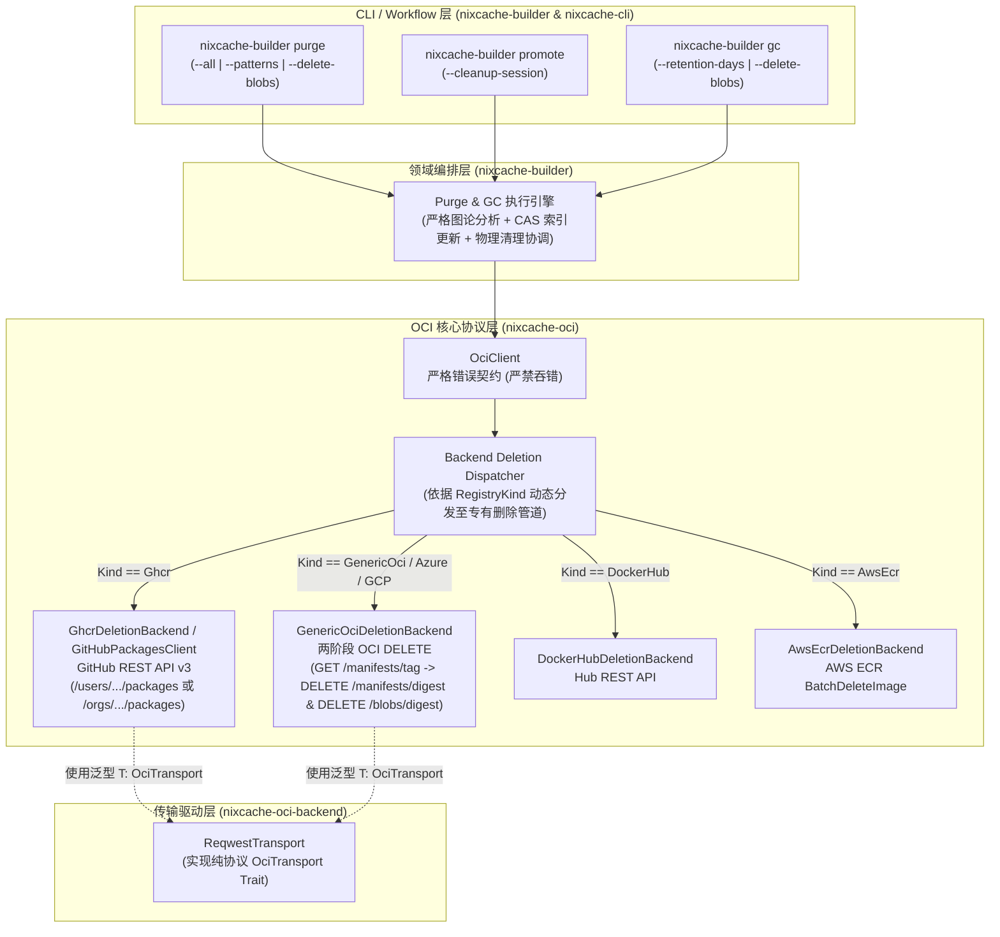
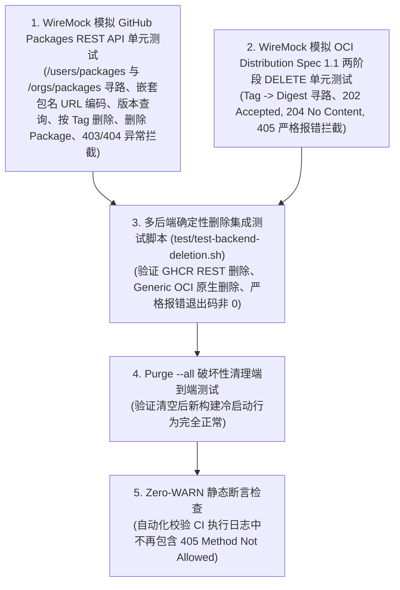

# NixCache OCI 多后端 Purge 缓存删除与严格错误体系重构设计方案

## 一、 背景与现状诊断

### 1.1 现状与问题根因
在当前的架构中，`nixcache-builder purge`、`gc` 以及 `promote` 的 Session 临时标签清理逻辑中，删除操作存在两大核心缺陷：

1. **GHCR 等 OCI 注册表原生 HTTP DELETE 端点不兼容**：
   - 标准 OCI 分发规范（OCI Distribution Spec 1.1）定义了 `DELETE /v2/<name>/manifests/<reference>` 和 `DELETE /v2/<name>/blobs/<digest>`。
   - **GitHub Container Registry (GHCR)** 的 OCI 端点实现**明确禁用了这两个端点**，收到请求后直接返回 `405 Method Not Allowed`。
   - 在 GHCR 中，删除包版本（Tag）、清理特定历史版本或删除整个 Package 必须通过 **GitHub Packages REST API**（`api.github.com`）执行。
   - 现有代码因仅尝试标准 OCI DELETE，导致在 GHCR 上完全无法真正删除任何 Package/Tag/Blob，所有删除请求全部以 405 失败。

2. **致命性异常被吞噬（静默 WARN 降级，违反系统可靠性契约）**：
   - 现有的 `delete_manifest` 和 `delete_blob` 在遇到 `StatusCode::METHOD_NOT_ALLOWED`（405）或删除失败时，直接通过 `tracing::warn!` 打印日志并返回 `Ok(false)`：
     ```rust
     // 现有缺陷实现示例 (crates/nixcache-oci/src/client.rs)
     } else if status == StatusCode::METHOD_NOT_ALLOWED {
         warn!("Registry does not support direct manifest deletion: {}", status);
         Ok(false) // 致命错误被伪装成正常返回！
     }
     ```
   - 在 `promote` 清理 Session Tag 以及 `purge` 删除 Blobs 时，调用方直接忽略返回值（`let _ = ...`）或仅打印 `skipped` 统计，导致用户虽然传入了删除指令（如 `--delete-blobs` 或 `--all`），控制台刷屏 8 次 WARN 但程序依然返回退出码 0，给用户“删除成功”的假象，造成严重的运维黑盒与不可靠状态。

### 1.2 重构目标
1. **多后端原生删除实现**：将删除语义提升至后端驱动级别（Provider Driver Level），每种注册表按其平台机制实现精准删除：
   - GHCR 调用 GitHub Packages REST API；
   - Generic OCI / Harbor / Zot / Distribution 调用两阶段标准 OCI DELETE（先解析 Tag 对应 Digest 再按 Digest 删除）；
   - Docker Hub / AWS ECR 各自适配。
2. **支持完整的包与版本删除能力**：
   - 支持删除指定 Tag / 单架构子清单。
   - 支持 `purge --all` 彻底删除/重置整个远程 Package 与索引。
   - 支持物理 Blobs 删除（按后端能力严格执行，不支持时在严格模式下精准报错）。
3. **零静默降级（Zero-Swallowed Errors）与严格错误契约分级**：
   - 彻底废除“打 WARN 并返回 `Ok(false)`”的伪成功行为。
   - 区分**幂等安全状态（404 Not Found）**与**协议/权限致命错误（401/403/405/5xx）**：
     - 404 Not Found 在清理场景下视为幂等成功（记录为 not found，允许安全继续）；
     - 401/403 权限不足、405 不支持的操作或 5xx 服务端错误**必须返回强类型错误并终止流程**，返回非 0 退出码，输出精准的根因诊断与修复指引（如缺少 `delete:packages` 权限）。
4. **允许且优先采用破坏性重构（Breaking Changes）**：
   - 重构 Trait 抽象、方法签名、能力矩阵与 CLI 严格模式参数，追求清晰、健壮与完全确定性。

---

## 二、 核心架构重构设计

### 2.1 整体架构视图



> **架构解耦说明**：`GitHubPackagesClient<T: OciTransport>` 完整定义在 `nixcache-oci` 内部，通过 `OciTransport` 发起请求，无需依赖特定的 HTTP 库，保证 `nixcache-oci` 与 `nixcache-oci-backend` 保持清晰的单向依赖关系（`nixcache-oci-backend` -> `nixcache-oci`），杜绝循环依赖。

---

## 三、 详细组件设计与破坏性接口变更

### 3.1 破坏性变更 1：扩展 `RegistryCapabilities` 与删除策略定义

在 `crates/nixcache-oci/src/backend/kind.rs` 中引入强类型删除策略枚举，并对能力矩阵进行破坏性重构：

```rust
/// 注册表后端删除策略分类
#[derive(Debug, Clone, Copy, PartialEq, Eq, Hash, Serialize, Deserialize)]
#[serde(rename_all = "snake_case")]
pub enum RegistryDeletionStrategy {
    /// 基于 GitHub Packages REST API 进行包、版本与 Tag 物理删除 (GHCR)
    GitHubPackagesRestApi,
    /// 基于 Docker Hub 专用 REST API 进行 Tag 删除 (Docker Hub)
    DockerHubRestApi,
    /// 基于 AWS ECR API (BatchDeleteImage) 进行删除
    AwsEcrApi,
    /// 遵循标准 OCI Distribution Spec 1.1 的 HTTP DELETE 端点 (Generic OCI, Harbor, Zot, Azure ACR 等)
    StandardOciDelete,
    /// 明确不支持任何物理删除操作的后端
    Unsupported,
}

/// 后端静态能力矩阵描述符 (破坏性扩展)
#[derive(Debug, Clone, PartialEq, Eq)]
pub struct RegistryCapabilities {
    pub supports_chunked_patch: bool,
    pub supports_monolithic_post_1rtt: bool,
    pub supports_manifest_cas_if_match: bool,
    pub requires_library_namespace_expansion: bool,
    pub fixed_upload_strategy: BlobUploadStrategy,
    pub custom_auth_endpoint: Option<&'static str>,

    // === 新增核心删除能力字段 ===
    /// 当前后端采用的删除调度策略
    pub deletion_strategy: RegistryDeletionStrategy,
    /// 是否支持物理删除 OCI NAR Blobs
    pub supports_blob_physical_deletion: bool,
    /// 是否支持物理删除整个 Package / Repository
    pub supports_package_deletion: bool,
}
```

各驱动的静态能力配置：
- **`GHCR_CAPABILITIES`**：
  - `deletion_strategy = RegistryDeletionStrategy::GitHubPackagesRestApi`
  - `supports_blob_physical_deletion = false`（GHCR 不允许通过 API 删除孤立 Blob，Blob 随 Package Version 自动回收）
  - `supports_package_deletion = true`（支持通过 GitHub API 删除整个包）
- **`GENERIC_OCI_CAPABILITIES`**：
  - `deletion_strategy = RegistryDeletionStrategy::StandardOciDelete`
  - `supports_blob_physical_deletion = true`
  - `supports_package_deletion = false`（需逐个删除 Manifest 与 Blob）
- **`DOCKER_HUB_CAPABILITIES`**：
  - `deletion_strategy = RegistryDeletionStrategy::DockerHubRestApi`
  - `supports_blob_physical_deletion = false`
- **`AWS_ECR_CAPABILITIES`**：
  - `deletion_strategy = RegistryDeletionStrategy::AwsEcrApi`
  - `supports_blob_physical_deletion = false`

---

### 3.2 破坏性变更 2：新增 `GitHubPackagesClient` 专有 REST 驱动

在 `crates/nixcache-oci/src/backend/ghcr.rs` 中构建原生 GitHub Packages REST API 交互层，直接基于通用 `OciTransport` 实现：

#### 1. API 路由与嵌套包名 URL 编码契约
- **Base URL**：`https://api.github.com`
- **Headers**：
  - `Authorization: Bearer <github_token>`
  - `Accept: application/vnd.github+json`
  - `X-GitHub-Api-Version: 2022-11-28`
  - `User-Agent: nixcache-oci/<version>`
- **URL 编码规则**：
  - GHCR 中的多层命名空间（例如 `owner/project/nix-cache`）在 GitHub REST API 中的 `package_name` 必须经过 Percent-Encoding（即 `project%2Fnix-cache`）。
  - 若 `repo` 为 `owner/nix-cache`，则 `package_name` 为 `nix-cache`；若为 `owner/sub/nix-cache`，则 `package_name` 为 `sub%2Fnix-cache`。

#### 2. 关键操作接口设计
```rust
use crate::{
    error::OciError,
    transport::OciTransport,
};
use serde::Deserialize;

#[derive(Debug, Clone)]
pub struct GitHubPackagesClient<T: OciTransport> {
    transport: T,
    token: String,
    owner: String,
    package_name: String, // 经过 URL 编码后的 package name
    is_org: Option<bool>, // 自动探测或缓存 Owner 类型
}

#[derive(Debug, Clone, Deserialize)]
pub struct GitHubPackageVersion {
    pub id: u64,
    pub name: String, // 通常为 digest 或版本标识
    pub metadata: GitHubPackageVersionMetadata,
}

#[derive(Debug, Clone, Deserialize)]
pub struct GitHubPackageVersionMetadata {
    pub container: GitHubContainerMetadata,
}

#[derive(Debug, Clone, Deserialize)]
pub struct GitHubContainerMetadata {
    pub tags: Vec<String>,
}

impl<T: OciTransport> GitHubPackagesClient<T> {
    /// 构造 GitHubPackagesClient
    pub fn new(transport: T, token: &str, repo_path: &str) -> Self {
        let clean = repo_path.trim_matches('/');
        let (owner, pkg) = match clean.split_once('/') {
            Some((o, rest)) => {
                let pkg_target = if rest.ends_with("/nix-cache") || rest == "nix-cache" {
                    rest.to_string()
                } else {
                    format!("{}/nix-cache", rest)
                };
                (o.to_string(), pkg_target.replace('/', "%2F"))
            }
            None => (clean.to_string(), "nix-cache".to_string()),
        };

        Self {
            transport,
            token: token.to_string(),
            owner,
            package_name: pkg,
            is_org: None,
        }
    }

    /// 列出指定 Package 的所有版本 (自动尝试 Org / User 路由)
    pub async fn list_package_versions(&self) -> Result<Vec<GitHubPackageVersion>, OciError>;

    /// 根据 Tag 查找对应的 Package Version ID
    pub async fn find_version_id_by_tag(&self, tag: &str) -> Result<Option<u64>, OciError>;

    /// 删除指定 Version ID 的包版本 (同步移除关联的 Tag)
    pub async fn delete_package_version(&self, version_id: u64) -> Result<(), OciError>;

    /// 根据 Tag 精确删除包版本 (若 Tag 不存在返回 Ok(()))
    pub async fn delete_by_tag(&self, tag: &str) -> Result<(), OciError>;

    /// 删除整个 Package (用于 purge --all)
    pub async fn delete_entire_package(&self) -> Result<(), OciError>;
}
```

#### 3. 用户（User）与组织（Org）自动智能寻路
- GitHub Packages REST API 区分 `/users/{username}/packages/container/{package_name}` 与 `/orgs/{org}/packages/container/{package_name}`。
- 驱动首次请求时优先尝试组织路由 `/orgs/{owner}/...`，若返回 `404 Not Found` 则透明回退至 `/users/{owner}/...` 并缓存所有者类型，避免开发者手动配置 `is_org`。

#### 4. 权限拦截与清晰报错（Actionable Error Messaging）
- 若返回 `403 Forbidden` 或 `401 Unauthorized`：
  - 明确抛出 `OciError::InsufficientPermission`，并在错误信息中打印诊断提示：
    ```text
    Error: Failed to delete package/tag on GHCR. HTTP 403 Forbidden.
    Cause: The provided GITHUB_TOKEN does not have 'delete:packages' scope.
    Remedy:
      1. For GitHub Actions: Ensure workflow permissions include 'packages: write'.
      2. For Personal Access Tokens (PAT): Enable 'delete:packages' and 'repo' scopes.
      3. For Organization packages: Ensure your account/token has Admin or Maintainer role on the package.
    ```

---

### 3.3 破坏性变更 3：`OciClient` 删除方法签名与错误模型重构（杜绝吞错）

彻底废除 `delete_manifest` 和 `delete_blob` 的宽松设计，替换为强语义方法与严格错误分级：

#### 1. 强类型错误定义 (`crates/nixcache-oci/src/error.rs`)
```rust
use crate::backend::RegistryKind;
use http::StatusCode;
use nixcache_core::CoreError;
use serde_json::Error as JsonError;
use std::io::Error as IoError;
use thiserror::Error;

#[derive(Error, Debug)]
pub enum OciError {
    #[error("Registry operation not supported on backend '{backend}': {reason}")]
    OperationNotSupported {
        backend: RegistryKind,
        reason: String,
    },

    #[error("Deletion failed for target '{target}' with status {status}: {details}")]
    DeletionFailed {
        target: String,
        status: StatusCode,
        details: String,
    },

    #[error("Insufficient permissions to delete '{target}'. Required scope: '{required_scope}'. Server response: {details}")]
    InsufficientPermission {
        target: String,
        required_scope: &'static str,
        details: String,
    },

    #[error("Target resource '{target}' not found on remote registry")]
    ResourceNotFound {
        target: String,
    },

    #[error("Authentication failed: {0}")]
    AuthFailed(String),

    #[error("Transport error: {0}")]
    Transport(#[from] TransportError),

    #[error("IO error: {0}")]
    Io(#[from] IoError),

    #[error("JSON error: {0}")]
    Json(#[from] JsonError),

    #[error("Core error: {0}")]
    Core(#[from] CoreError),

    #[error("Other error: {0}")]
    Other(String),
}
```

#### 2. `OciClient` API 破坏性升级与调度逻辑
```rust
use crate::{
    backend::RegistryDeletionStrategy,
    error::OciError,
    transport::OciTransport,
};
use nixcache_core::NarDigest;

#[derive(Debug, Clone, Default)]
pub struct DeletionSummary {
    pub deleted_count: usize,
    pub not_found_count: usize,
    pub failed_count: usize,
    pub freed_bytes: u64,
}

impl<T: OciTransport> OciClient<T> {
    /// 严格删除指定 Tag：
    /// - GHCR: 走 GitHub Packages REST API 查找并删除对应的 Package Version；
    /// - Generic OCI: 两阶段安全删除（先 HEAD/GET /manifests/<tag> 获得 Manifest Digest，再 DELETE /manifests/<digest>）；
    /// - 若资源不存在 (404) 视为幂等成功返回 Ok(())；若遇到 401/403/405/5xx 坚决返回 Err。
    pub async fn delete_tag_strict(&self, tag: &str) -> Result<(), OciError>;

    /// 严格删除指定 Manifest Digest (DELETE /v2/<repo>/manifests/<digest>)
    pub async fn delete_manifest_strict(&self, digest: &str) -> Result<(), OciError>;

    /// 严格删除单个 OCI NAR Blob (DELETE /v2/<repo>/blobs/<digest>)
    /// 若后端不支持物理删除 (如 GHCR)，抛出 OperationNotSupported 错误
    pub async fn delete_blob_strict(&self, digest: &str) -> Result<(), OciError>;

    /// 高并发批量物理删除 Blobs：
    /// - 若 strict_mode 为 true 且后端不支持或删除失败，抛出错误终止；
    /// - 若 strict_mode 为 false，记录 failed_count 并返回统计报告。
    pub async fn batch_delete_blobs_strict(
        &self,
        digests: &[NarDigest],
        concurrency: usize,
        strict_mode: bool,
    ) -> Result<DeletionSummary, OciError>;

    /// 彻底删除/重置远程 Package (适用于 purge --all)：
    /// - GHCR: DELETE /orgs或users/{owner}/packages/container/{pkg}；
    /// - Generic OCI: 遍历删除已知 index 和 manifests，并清空 blobs。
    pub async fn delete_entire_package_strict(&self) -> Result<(), OciError>;
}
```

---

### 3.4 破坏性变更 4：`purge` 与 `promote` 业务层执行重构

#### 1. `nixcache-builder purge` 行为重构 (`crates/nixcache-builder/src/purge.rs`)
- **处理 `--all` 参数**：
  - 当指定 `--all` 时：
    - 检查当前后端的 `capabilities().supports_package_deletion`：
      - 若支持（如 GHCR）：调用 `oci.delete_entire_package_strict()` 快速彻底清空 Package；
      - 若不支持（如 Generic OCI）：发布一个空的 `cache-index`，若开启 `--delete-blobs` 则批量删除所有历史 Blobs；
    - 若发生权限不足或网络异常，**立即报错退出，进程返回非 0 退出码**。
- **处理 `--delete-blobs` 参数**：
  - 检查当前后端的 `capabilities().supports_blob_physical_deletion`：
    - 若当前后端为 GHCR（不支持单独删除 Blob）：
      - 若用户未开启 `--allow-unsupported-blob-deletion`：**立即报错终止**，提示：“GHCR does not support standalone OCI blob deletion. Blobs are managed via package versions. To delete unused data on GHCR, use tag deletion or 'purge --all'.”
      - 若开启了 `--allow-unsupported-blob-deletion`：在终端输出 NOTICE 并跳过 Blob 物理删除阶段。
    - 若后端支持物理删除（如 Generic OCI）：调用 `oci.batch_delete_blobs_strict(&digests, 8, strict_mode)` 批量删除。
- **重构 Session 清理 (`crates/nixcache-builder/src/promote.rs`)**：
  - `cleanup_session` 调用 `oci.delete_tag_strict(&tag)`。
  - 在 GHCR 下通过 GitHub API 删除 `run-<run_id>` 及其各架构 Tag；
  - 遇到 404 视为已清理安全忽略，遇到 403 / 405 抛出错误终止；
  - 彻底消除 8 行 `405 Method Not Allowed` 警告！

---

## 四、 README.md 与 CLI 参数契约升级方案

### 4.1 CLI 参数变更（`nixcache-cli` 与 `nixcache-builder`）

在 `nixcache-builder purge` 中新增与调整参数：

| 命令行参数 | 环境变量 | 默认值 | 描述 | 变更性质 |
| :--- | :--- | :--- | :--- | :--- |
| `--all` | `NIXCACHE_FILTER_ALL`, `NIXCACHE_PURGE_ALL` | `false` | **一键彻底清空**：按后端原生机制彻底删除/重置远程 Package 与所有索引 | 行为确定性强化 |
| `--delete-blobs` | `NIXCACHE_DELETE_BLOBS` | `false` | 尝试物理删除 OCI Blobs（若后端不支持物理删除，默认报错退出） | 严格模式强化 |
| `--allow-unsupported-blob-deletion` | `NIXCACHE_ALLOW_UNSUPPORTED_BLOB_DELETION` | `false` | 当目标后端（如 GHCR）不支持 Blob 物理删除时，允许忽略错误并仅更新清单 | **新增** |
| `--strict` | `NIXCACHE_STRICT` | `true` | 严格模式：删除过程中遇到任何鉴权或不支持错误立即报错退出，禁止静默忽略 | **新增**（默认开启） |

### 4.2 README.md 文档对齐方案

需在 `README.md` 的以下章节进行针对性更新：
1. **主流 OCI 注册表支持矩阵**：增加一列“**删除与清理支持机制 (`DeletionStrategy`)**”，明确标注 GHCR 采用 GitHub Packages REST API、Generic OCI 采用两阶段 OCI Spec 1.1 DELETE。
2. **Purge Cache 与 GC 章节**：
   - 补充说明 GHCR 删除包所需的 GitHub Token 权限（GitHub Actions 需 `packages: write`，PAT 需 `delete:packages`）。
   - 明确说明 `--all` 和 `--delete-blobs` 在不同后端下的严格行为与 `--allow-unsupported-blob-deletion` 的适用场景。
3. **故障排查章节（Troubleshooting）**：
   - 增加“GHCR 删除权限排查指南”，提供 403 / 401 常见权限配置错误的修复方案。

---

## 五、 测试矩阵与质量保障计划

遵循项目的 **8 层测试金字塔** 规范，建立全套自动化测试套件：



### 5.1 具体测试用例设计
1. **GHCR REST API 仿真测试 (`crates/nixcache-oci/tests/ghcr_deletion.rs`)**：
   - 测试通过 `/orgs/{org}/packages/container/{pkg}/versions` 查找到 Tag 对应的 Version ID 并发起 DELETE。
   - 测试多级存储库路径（`owner/sub/nix-cache`）时 URL 编码转换是否正确（`sub%2Fnix-cache`）。
   - 测试当返回 403 时，正确转换为 `OciError::InsufficientPermission` 并包含修复提示。
2. **Generic OCI 两阶段删除测试 (`crates/nixcache-oci/tests/oci_deletion.rs`)**：
   - 模拟通过 HEAD 获取 `Docker-Content-Digest` 后调用 DELETE `/manifests/<digest>`。
   - 模拟 Registry 返回 405 时，断言 `delete_tag_strict` / `delete_manifest_strict` 必须返回 `Err(OciError::DeletionFailed)`，禁止返回 `Ok(_)`.
3. **Purge 命令端到端测试 (`test/test-purge-cas.sh`)**：
   - 验证 `nixcache-builder purge --all` 和 `purge --patterns ...` 在 Mock 环境下的原子更新与删除联动。

---

## 六、 实施路径与模块变更清单

| 阶段 | 模块 / Crate | 涉及文件 | 核心重构任务 |
| :--- | :--- | :--- | :--- |
| **阶段 1** | `nixcache-oci` | `crates/nixcache-oci/src/backend/kind.rs`<br>`crates/nixcache-oci/src/backend/driver.rs` | 引入 `RegistryDeletionStrategy`，扩展 `RegistryCapabilities`，配置 GHCR / Generic OCI / Docker Hub / AWS ECR 删除策略 |
| **阶段 2** | `nixcache-oci` | `crates/nixcache-oci/src/backend/ghcr.rs` (新)<br>`crates/nixcache-oci/src/backend.rs` | 基于 `OciTransport` 实现 `GitHubPackagesClient`，支持组织/用户自动寻路、嵌套包名 URL 编码与 Tag/Version/Package 删除 |
| **阶段 3** | `nixcache-oci` | `crates/nixcache-oci/src/error.rs`<br>`crates/nixcache-oci/src/client.rs` | 重构 `OciError`，实现 `delete_tag_strict`、`delete_manifest_strict`、`delete_blob_strict`、`delete_entire_package_strict`，消除所有吞错与静默 WARN |
| **阶段 4** | `nixcache-cli` | `crates/nixcache-cli/src/args/purge.rs` | 增加 `--allow-unsupported-blob-deletion`、`--strict` 等 CLI 参数及环境变量解析 |
| **阶段 5** | `nixcache-builder` | `crates/nixcache-builder/src/purge.rs`<br>`crates/nixcache-builder/src/promote.rs`<br>`crates/nixcache-builder/src/gc.rs` | 接入原生后端删除管道，重构 `purge --all`、Session 清理与 GC 物理删除逻辑 |
| **阶段 6** | `docs & test` | `README.md`<br>`crates/nixcache-oci/tests/ghcr_deletion.rs`<br>`test/test-backend-deletion.sh` | 更新 README 文档，编写自动化单元测试与集成测试，验证零 WARN 与严格错误返回 |

---

## 七、 总结

本方案通过**领域驱动的分层删除策略**与**零静默降级（Zero-Swallowed Errors）原则**，从根本上解决了 GHCR 无法通过 OCI 协议删除包的限制，同时彻底纠正了原代码中“遇到致命错误只打 WARN 假装成功”的设计缺陷。重构完成后，`purge`、`gc` 和 `promote` 将具备完全的确定性、强类型安全契约以及精准的可观测性。
