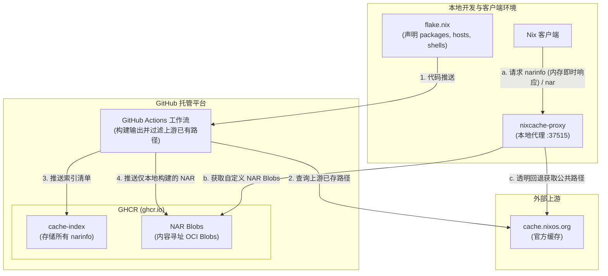

# nixcache-oci

将任何 GitHub 仓库转变为 Nix 二进制缓存（Binary Cache）。推送你的 Flake，即可自动获得专属的二进制缓存。对公开仓库完全免费。

本项目使用 GitHub Container Registry (GHCR) 作为存储后端 —— NAR 包将作为 OCI blob 存储，并结合单文件索引清单（Index Manifest）实现极速的路径查找。无需运行额外的外部服务器、CDN 或数据库。

## 工作原理

1. 在指定的配置目录（如您在 `env/default.env` 中配置的 `NIXCACHE_CONFIG_DIR`）中声明你需要缓存的软件包（packages）、NixOS 主机（hosts）或开发环境（dev shells）。

2. **GitHub Actions** 会自动构建所有内容，检测并过滤掉 `cache.nixos.org` 上已经存在的 store 路径，然后将仅在本地构建的 NAR 文件作为内容寻址的 OCI blob 推送到 GHCR。

3. **本地代理服务（Local Proxy）** 会从缓存的索引中提供 `.narinfo` 信息（实现零延迟的本地查找），并在客户端有需求时流式下载 GHCR 中的 NAR blob。如果请求的路径存在于上游缓存（如 `cache.nixos.org`），代理会自动且透明地重定向到上游。

## 快速开始

### 发布缓存

你可以选择以下两种方式之一来发布二进制缓存：

#### 方式一：直接在你的 GitHub 仓库中使用 GitHub Action（推荐，无需 fork）

你可以在你现有的 Flake 项目仓库中，直接在 GitHub Actions 工作流中调用本项目的 Action 来构建并发布缓存。

1. 在你的仓库中创建 `.github/workflows/publish-cache.yml`：
   - **Flake 模式（默认）：**
     ```yaml
     name: Publish Cache
     on:
       push:
         branches: [ main ]
       workflow_dispatch:

     permissions:
       contents: read
       packages: write

     jobs:
       publish:
         runs-on: ubuntu-latest
         steps:
           - uses: actions/checkout@main

           - name: Install Nix
             uses: DeterminateSystems/nix-installer-action@main

           - name: Publish to GHCR
             uses: shaogme/nixcache-oci@main
             with:
               mode: 'flake'
               flake-path: '.' # 你的 flake.nix 所在的目录路径，默认为当前目录
               signing-key: ${{ secrets.NIX_SIGNING_KEY }} # 可选，签名私钥
     ```

   - **非 Flake 模式：**
     ```yaml
     name: Publish Cache
     on:
       push:
         branches: [ main ]
       workflow_dispatch:

     permissions:
       contents: read
       packages: write

     jobs:
       publish:
         runs-on: ubuntu-latest
         steps:
           - uses: actions/checkout@main

           - name: Install Nix
             uses: DeterminateSystems/nix-installer-action@main

           - name: Publish to GHCR
             uses: shaogme/nixcache-oci@main
             with:
               mode: 'non-flake'
               file: 'default.nix' # 选填，Nix 文件路径，默认为 'default.nix'
               attributes: 'my-package another-package' # 选填，要构建的属性（以空格隔开），留空则构建整个 expression
               signing-key: ${{ secrets.NIX_SIGNING_KEY }} # 可选，签名私钥
     ```

2. 参见下文的[签名配置](#签名配置)生成并配置 `NIX_SIGNING_KEY` 密钥。

3. **版本控制（可选）**：如果你想锁定并使用特定版本的 `nixcache-oci` 工具，只需在你仓库根目录下创建一个 `.nixcache-version` 文件，在其中写入要锁定的 commit hash 或 tag（例如 `842ad0d1952768890c96edf77f7c8b9d104e5969`）。如果该文件不存在，Action 会默认回退使用 Action 自身的 Ref 或最新 `main` 实现。
   * **自动升级**：如果你希望工具能够保持最新，同时又能显式锁定和审计版本，我们提供了一个自动更新 `.nixcache-version` 文件的 Action 示例。你可以将 [update-nixcache-version.yml](file:///root/workspace/examples/update-nixcache-version.yml) 放入你的项目仓库工作流中，以实现每天自动检测最新 commit 并提交。


#### 方式二：Fork 本项目（声明式管理）

1. Fork 本项目，并克隆到本地。
2. 不建议修改 `examples/*`，而是修改 `env/default.env` 环境变量文件来进行配置：
   - 将 `NIXCACHE_EXAMPLE` 设置为 `0` 以停用示例配置。
   - 根据需求配置 `NIXCACHE_MODE`（如 `flake`）以及 `NIXCACHE_CONFIG_DIR`（例如指向您的 Flake 目录路径）。
   - 在您指定的目录中编写 `flake.nix`（或 `default.nix` 等）来声明需要缓存的软件、系统配置或开发环境。
3. 推送更改到 `main` 分支。GitHub Actions 工作流会自动构建并发布仅本地编译过的 store 路径。
4. 参见下文的[签名配置](#签名配置)生成并配置 `NIX_SIGNING_KEY` 密钥。

### 签名配置

配置签名是可选的，但强烈推荐。它允许 Nix 客户端验证软件包在传输过程中未被篡改。

#### 方案 A —— 无签名（快速开始/测试）

如果你没有设置 `NIX_SIGNING_KEY` 密钥，二进制缓存依然可以正常工作，但软件包将不带签名。此时客户端必须禁用签名校验：

> [!WARNING]
> 设置 `require-sigs = false` 和 `requireSignatures = false` 会全局禁用**所有**替代器（substituters）的签名校验，而不仅仅是针对该缓存。这意味着来自 `cache.nixos.org` 和其他公共缓存的包也将不经验证就被接受。这在个人使用或测试环境中是可以接受的，但在多用户或生产系统中，请务必设置正确的签名。

**NixOS 模块配置：**
```nix
services.nixcache-proxy = {
  enable = true;
  repo = "my-org/my-cache"; # 替换为您自己的 GitHub 仓库
  requireSignatures = false;
};
```

**手动修改 `nix.conf`：**
```ini
extra-substituters = http://localhost:37515
extra-trusted-substituters = http://localhost:37515
require-sigs = false
```

#### 方案 B —— 有签名（推荐）

**步骤 1 — 生成密钥对**（在一台安全的机器上运行一次即可）：
```bash
nix-store --generate-binary-cache-key my-cache-1 secret.key public.key
```

运行后将生成两个文件：
- `secret.key` — 私钥（请务必妥善保管，切勿泄露）
- `public.key` — 公钥，内容格式类似于 `my-cache-1:BASE64...=`（提供给客户端）

**步骤 2 — 存储私钥**到 GitHub Actions Secrets 中：

进入你的 GitHub 仓库的 **Settings > Secrets and variables > Actions**，新建一个名为 `NIX_SIGNING_KEY` 的 Secret，并将 `secret.key` 文件中的内容粘贴进去。

**步骤 3 — 将公钥提供给客户端。** 打开 `public.key` 复制里面的字符串，类似于：
```
my-cache-1:AAAAAAAAAAAAAAAAAAAAAAAAAAAAAAAAAAAAAAAAAAA=
```

客户端需要使用此公钥来校验包的完整性。有以下三种配置方式：

**NixOS 模块配置：**
```nix
services.nixcache-proxy = {
  enable = true;
  repo = "my-org/my-cache"; # 替换为您自己的 GitHub 仓库
  publicKey = "my-cache-1:AAAAAAAAAAAAAAAAAAAAAAAAAAAAAAAAAAAAAAAAAAA=";
};
```

**手动修改 `nix.conf`：**
```ini
extra-substituters = http://localhost:37515
extra-trusted-substituters = http://localhost:37515
extra-trusted-public-keys = my-cache-1:AAAAAAAAAAAAAAAAAAAAAAAAAAAAAAAAAAAAAAAAAAA=
```

**自动发现**：如果发布时配置了签名，代理服务会自动在 `http://localhost:37515/public-key` 接口上公开你的公钥。

此外，当构建工作流运行时，公钥也会被自动提交到仓库根目录下的 `public-key.txt` 文件中，方便你随时查阅和复制。

### 客户端消费（使用缓存）

#### 方法一 —— 手动运行本地代理：
```bash
nix run github:shaogme/nixcache-oci#cache-proxy -- --repo my-org/my-cache &
```
然后配置 Nix 客户端（详见上面的[签名配置](#签名配置)）。

#### 方法二 —— NixOS 模块（常驻系统服务，推荐）：
```nix
{
  inputs.nixcache.url = "github:shaogme/nixcache-oci";
  outputs = { nixcache, ... }: {
    nixosConfigurations.myhost = nixpkgs.lib.nixosSystem {
      modules = [
        nixcache.nixosModules.default
        {
          services.nixcache-proxy = {
            enable = true;
            repo = "my-org/my-cache"; # 必须指定您的 GitHub 仓库
            # 使用签名的情况：
            publicKey = "my-cache-1:BASE64KEY...=";
            # 不使用签名的情况：
            # requireSignatures = false;
          };
        }
      ];
    };
  };
}
```

这会将本地代理以 `systemd` 服务形式启动，并自动配置 Nix 的替代器（substituters）和可信公钥。

##### NixOS 模块可配置参数：

| 参数项 | 类型 | 默认值 | 描述 |
|---|---|---|---|
| `services.nixcache-proxy.enable` | boolean | `false` | 是否启用 nixcache-proxy 本地代理服务 |
| `services.nixcache-proxy.package` | package | 源码构建的 `cache-proxy` 包 | 要使用的 nixcache-proxy 软件包 |
| `services.nixcache-proxy.repo` | string | `"shaogme/nixcache-oci"` | 托管 OCI 二进制缓存的 GitHub 仓库名称 |
| `services.nixcache-proxy.port` | port | `37515` | 本地代理服务监听的端口 |
| `services.nixcache-proxy.listenAddress`| string | `"127.0.0.1"` | 本地代理服务绑定的 IP 地址（若为其他机器服务可设为 `"0.0.0.0"`） |
| `services.nixcache-proxy.publicKey` | string | `""` | 校验包签名所用的 Base64 公钥，留空代表不校验（此时需将 `requireSignatures` 设为 `false`） |
| `services.nixcache-proxy.requireSignatures`| boolean | `true` | 是否强制校验缓存包的签名 |


#### 方法三 —— 非 Flake 方式（直接构建，推荐在传统 Nix 环境下使用）：
如果你没有启用 Flake，可以直接使用 `default.nix` 构建并运行本地代理：
```bash
nix-build -A cache-proxy
./result/bin/nixcache-proxy --repo my-org/my-cache &
```

此外，`default.nix` 已经对齐了 Flake 的输出结构，在非 Flake 环境下也可以直接导入并使用 NixOS 模块：
```nix
# 在传统 Nix/NixOS 配置中导入
let
  nixcache = import ./path/to/nixcache-oci {};
in {
  imports = [ nixcache.nixosModules.default ];
  services.nixcache-proxy = {
    enable = true;
    repo = "my-org/my-cache"; # 替换为您自己的 GitHub 仓库
  };
}
```

### 使用预编译的二进制包（推荐，免编译）

本项目在 GitHub Actions 中配置了跨架构（`x86_64-linux`、`aarch64-linux`、`x86_64-darwin`、`aarch64-darwin`）的预编译二进制发布流水线，并且与 Git Commit SHA 强绑定以保证版本控制的严密性。如果您的系统为上述支持的架构之一，建议使用预编译包以节省本地编译时间和内存资源。

在不同场景下，只需在原包名后加上 `-bin` 后缀即可使用：

* **命令行即时运行**：
  ```bash
  nix run github:shaogme/nixcache-oci#cache-proxy-bin -- --repo my-org/my-cache &
  ```

* **NixOS 模块引用**：
  ```nix
  services.nixcache-proxy = {
    enable = true;
    repo = "my-org/my-cache"; # 替换为您自己的 GitHub 仓库
    # 覆盖默认的源码编译包，改用预编译包
    package = nixcache.packages.${pkgs.system}.cache-proxy-bin;
  };
  ```

* **非 Flake 方式（直接构建）**：
  ```bash
  nix-build -A cache-proxy-bin
  ./result/bin/nixcache-proxy --repo my-org/my-cache &
  ```

### 开发与依赖更新

本项目使用 `npins` 管理 Nix 依赖。如果你需要更新 `nixpkgs` 或其他依赖，请在项目根目录下运行：
```bash
npins update
```
该命令会自动更新 `npins/sources.json` 锁定文件。请在更新后提交该文件的修改。


## 配置参数说明

现在 `nixcache-proxy` 和 `nixcache-builder` 均同时支持命令行参数与环境变量配置（命令行参数优先级更高）。

### 代理服务 (nixcache-proxy) 配置

| 命令行参数 | 环境变量 | 默认值 | 描述 |
|---|---|---|---|
| `--repo <REPO>` | `NIXCACHE_REPO` | （无） | OCI 仓库名称 (例如: `shaogme/nixcache-oci`) |
| `--registry <REGISTRY>` | `NIXCACHE_REGISTRY` | `ghcr.io` | OCI 镜像托管源 |
| `--port <PORT>` | `NIXCACHE_PORT` | `37515` | 代理服务监听端口 |
| `--listen <LISTEN>` | `NIXCACHE_LISTEN` | `127.0.0.1` | 绑定监听地址（设置为 `0.0.0.0` 可对局域网提供服务） |
| `--upstream <UPSTREAM>` | `NIXCACHE_UPSTREAM` | `https://cache.nixos.org` | 上游缓存的 URL 地址（多个以空格分隔） |
| `--index-dir <DIR>` | `NIXCACHE_INDEX_DIR` | （见下方说明） | 缓存索引存储目录（若未指定，回退至 `CACHE_DIRECTORY` 环境变量或 `~/.cache/nixcache-proxy/...`） |
| `--index-ttl <TTL>` | `NIXCACHE_INDEX_TTL` | `300` | 索引的本地缓存时间（单位：秒） |
| `--github-token <TOKEN>` | `GITHUB_TOKEN` / `GH_TOKEN` | （无） | 用于认证 GitHub 接口/私有仓库的 Token |

---

### 构建与管理服务 (nixcache-builder) 配置

| 命令行参数 | 环境变量 | 默认值 | 描述 |
|---|---|---|---|
| `-g`, `--gc` | - | `false` | 运行垃圾回收（Garbage Collection） |
| `--retention-days <DAYS>`| - | `30` | 垃圾回收所保留的缓存包天数 |
| `--dry-run` | - | `false` | 垃圾回收试运行（仅输出，不执行实际删除） |
| `--repo <REPO>` | `NIXCACHE_REPO` | `shaogme/nixcache-oci` | 目标 OCI 仓库名称 |
| `--registry <REGISTRY>` | `NIXCACHE_REGISTRY` | `ghcr.io` | 目标 OCI 镜像托管源 |
| `--signing-key-file <FILE>`| `NIXCACHE_SIGNING_KEY_FILE`| （无） | 签名私钥文件路径 |
| `--mode <MODE>` | `NIXCACHE_MODE` | `flake` | 构建模式，可选值: `flake` 或 `non-flake` |
| `--flake-path <PATH>` | `NIXCACHE_FLAKE_PATH` | `.` | 含有 `flake.nix` 的目录路径 |
| `--config-dir <PATH>` | `NIXCACHE_CONFIG_DIR` | （无） | 配置目录路径（`flake-path` 的回退选项） |
| `--file <FILE>` | `NIXCACHE_FILE` | `default.nix` | 非 Flake 模式下的构建目标文件 |
| `--attributes <ATTRS>` | `NIXCACHE_ATTRIBUTES` | （无） | 非 Flake 模式下要构建的属性（以逗号或空格分割） |
| `--github-token <TOKEN>` | `GITHUB_TOKEN` / `GH_TOKEN` | （无） | GitHub 认证 Token（未提供时会尝试通过本地 `gh auth token` 自动获取） |

### 代理如何工作

代理服务只缓存一样东西：**索引（Index）**（包含所有的 `.narinfo` 数据）。索引会被加载到内存中，并根据 `NIXCACHE_INDEX_TTL`（默认 5 分钟）定期从 GHCR 刷新。这意味着 `.narinfo` 的查找是即时的 —— 不需要进行任何网络往返。在你的 Actions 成功发布新构建后，客户端最晚会在该时间窗口内看到新包。

**NAR blob 采用直通式流传输**：从 GHCR（或上游缓存）获取的数据会直接以 64 KB 的块流式传输给 Nix 客户端。代理服务不会在内存中缓冲整个包，也不会将其写入代理主机的磁盘。Nix 客户端收到数据后，会像往常一样直接将其解压存入本地的 `/nix/store/`。这保证了本地代理服务几乎不占用磁盘空间，并且内存消耗极低。

### 代理管理端点

| 端点路径 | HTTP 方法 | 描述 |
|---|---|---|
| `/_status` | GET | 查看索引条目、配置和上游缓存的状态 |
| `/_refresh` | POST | 强制立即刷新索引（无需等待 TTL 过期） |
| `/public-key` | GET | 获取配置的二进制缓存签名公钥（如果已启用签名） |

```bash
# 查看状态
curl http://localhost:37515/_status

# 在发布新包后，强制立即刷新本地缓存
curl -X POST http://localhost:37515/_refresh
```

## 架构




### 输出自动发现机制

GitHub Actions 工作流会自动发现并构建您指定的 Flake 配置中的下列输出：
- `packages.<system>.<name>` -- 该运行器架构下的所有软件包。
- `nixosConfigurations.<hostname>` -- 构建每个主机的 `config.system.build.toplevel`。
- `devShells.<system>.<name>` -- 所有的开发环境 Shell。

### 哪些路径会被缓存

为了节省存储空间，**只有本地构建生成的 store 路径**会被上传到 GHCR。如果在 `cache.nixos.org` 上已经存在该路径，工作流在上传时会自动跳过它。本地代理会自动重定向并向上游请求这些公共路径，使得客户端能够获取完整的依赖关系，而无需占用你个人的 GHCR 存储空间。

### 为什么选择 OCI / GHCR

- **天然的内容寻址**：NAR 包的 sha256 哈希值可以直接映射为 OCI blob 的哈希，天然实现去重。
- **无文件数限制**：OCI 仓库允许存储任意数量的 blob，无需担心传统存储服务的分区限制。
- **完全免费**：GHCR 对于公开仓库的包提供无限的存储容量和网络带宽。
- **单一索引清单**：所有的 `.narinfo` 元数据全部合并存在一个单独的 blob 索引中，本地代理在初始化或刷新时一次性拉取，后续查询全部在本地内存中完成，消除了逐个网络请求的开销。
- **超大文件支持**：单个 blob 支持最大约 10 GiB，能够轻松应对超大型软件包。

### 垃圾回收（Garbage Collection）

`gc-cache.yml` 工作流每周会自动运行，用于清理不需要的旧缓存，判定标准为：
- 该缓存路径不属于当前 Flake 任意输出的依赖闭包（Closure）。
- 且该缓存已超过保留期限（默认 30 天）。

你可以通过以下命令手动触发垃圾回收：`gh workflow run gc-cache.yml`。

## 局限性

- **必须运行本地代理**：Nix 客户端无法直接与 OCI 协议通信，因此必须在本地运行代理服务来进行协议桥接。
- **GitHub 接口频率限制**：GitHub 的 API 对于未认证的用户有限制，已认证用户为每小时 5,000 次。代理通过本地内存索引和 Nix 自带的缓存机制来大幅减少对 GitHub API 的直接请求，从而缓解这一限制。
- **私有仓库限制**：私有仓库的 GHCR 存储和带宽超出免费额度（500 MB 存储，1 GB/月流量）后将按量计费。公开仓库则完全免费。
- **GitHub 依赖性**：如果 GitHub 或 GHCR 发生宕机，你的自定义软件包缓存将暂时不可用（但上游缓存如 `cache.nixos.org` 中的官方软件包依然可以通过代理透明回退访问）。

