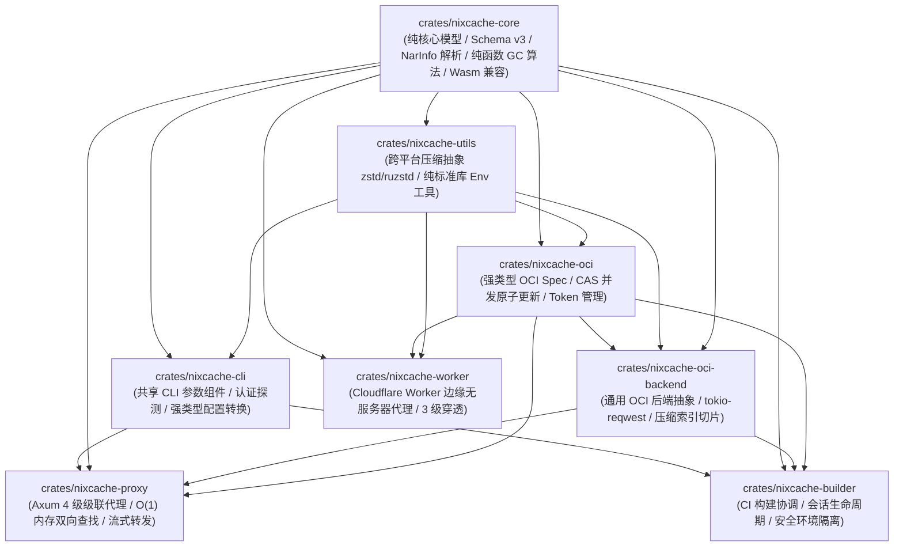
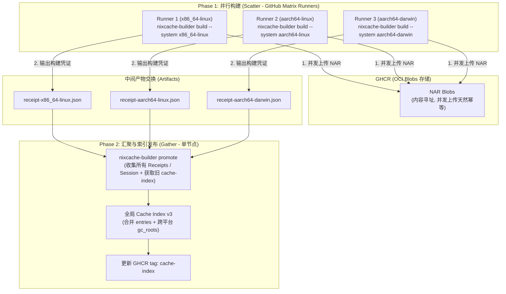
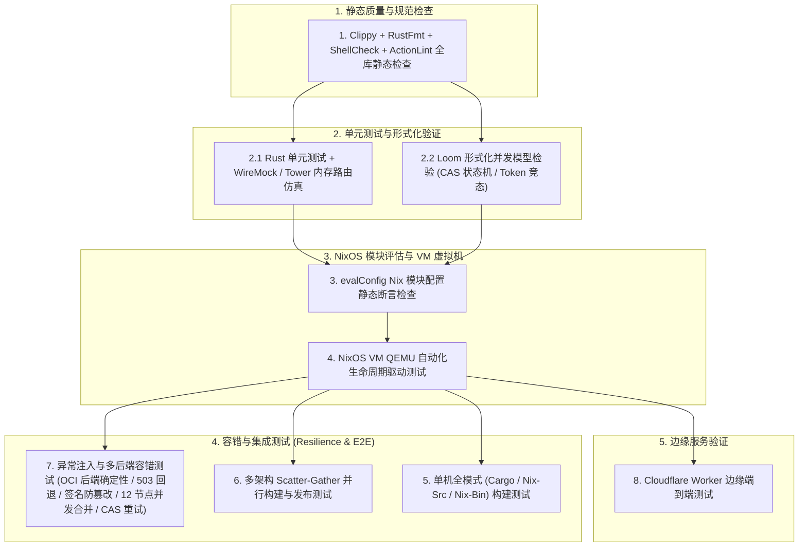

# nixcache-oci

将任何 GitHub 仓库或企业私有 OCI 镜像仓库转变为高性能 Nix 二进制缓存（Binary Cache）。推送你的 Flake，即可自动获得专属的二进制缓存。对公开仓库完全免费。

本项目以 OCI 镜像分发协议为基础 —— NAR 包将作为 OCI blob 存储，并结合单文件压缩索引清单（Index Manifest）实现极速的路径查找。无需维护专用的外部二进制缓存服务、CDN 或复杂数据库。

## 工作原理与核心架构

1. **多架构声明与自动过滤**：在指定的配置目录（如您在 `env/default.env` 中配置的 `NIXCACHE_CONFIG_DIR`）中声明需要缓存的软件包（packages）、NixOS 主机（hosts）或开发环境（dev shells）。**GitHub Actions** 并行构建产物，自动过滤 `cache.nixos.org` 上已存在的 store 路径，将本地构建的 NAR 文件作为内容寻址的 OCI blob 推送到 OCI 注册表（如 GHCR）。

2. **多后端原生驱动与静态确定性（Static Determinism）**：
   - **多态后端驱动体系（First-Class Provider Drivers）**：原生支持 GitHub Packages (GHCR)、Docker Hub、AWS ECR、Google Cloud Artifact Registry (GAR)、Azure ACR 与通用 OCI (Harbor / Zot / Distribution / Quay)。
   - **Docker Hub 原生适配**：自动规范化 `docker.io` 域名为 `registry-1.docker.io`，自动扩展官方单段镜像为 `library/<name>` 命名空间，专用 Token Auth 路由。

3. **4 级级联缓存与 $O(1)$ 极速解析（Cascading Resolver）**：
   - **Tier 0（即时内存热缓存）**：流水线当前构建步骤产生的产物，动态注册后 $0\text{ ms}$ 极速穿透供后续步骤使用。
   - **Tier 1（工作流会话缓存 `run-<run_id>`）**：同一 Workflow Run 中各矩阵并行 Job 共享的会话级缓存。
   - **Tier 2（分支/PR 会话缓存 `branch-<name>`）**：同分支或 PR 历史迭代的快速增量缓存。
   - **Tier 3（生产基线缓存 `cache-index`）**：合并发布后的生产全局统一索引清单。
   - **Upstream（上游透明回退）**：请求不存在于任何 Tier 时，透明重定向并回退至 `cache.nixos.org` 等公共缓存源。
   - 全链路在内存中维护双向哈希与 NAR Basename 映射表，彻底消除线性扫描，将路径与 NAR Blob 寻址降为 **$O(1)$ 常数时间**。

4. **直通式流传输与零常驻开销**：从 OCI Registry 或上游获取的 NAR blob 以流式（Streaming）形式直接转发给 Nix 客户端，无需在本地磁盘缓冲解压。全链路集成 **`mimalloc` 高性能全局内存分配器**，显著降低高并发与 musl 静态目标下的锁争用与内存碎片，常驻开销极低。

5. **解耦的 8-Crate 架构体系**：
   - `nixcache-core`：纯核心数据模型、Schema v3 规范、NarInfo 解析器与纯函数 GC 算法（零原生 IO 依赖，全平台与 Wasm 兼容）。
   - `nixcache-utils`：跨平台系统调用封装、纯标准库环境变量读取清洗（`Env` 抽象），以及统一的 Zstd 压缩解压抽象（原生 `zstd` 与 Wasm `ruzstd` 统一接口，零 tokio/clap 依赖）。
   - `nixcache-cli`：共享 CLI 参数组件（`OciTargetArgs` 支持 `--registry-kind` 自动推导、`AuthTokenArgs`、`ServerBindArgs` 等）与声明式强类型领域配置转换体系。
   - `nixcache-oci`：强类型 OCI Spec 协议交互引擎、`OciBackendDriver` 多态驱动抽象、`RegistryKind`、`RegistryCapabilities`、`BlobUploadStrategy`、CAS 并发安全更新器与并发防击穿 Token 管理器。
   - `nixcache-oci-backend`：多后端提供者驱动实现（`GhcrDriver`、`DockerHubDriver`、`AwsEcrDriver`、`GcpArtifactRegistryDriver`、`AzureAcrDriver`、`GenericOciDriver`）与 `tokio-reqwest` 运行时实现，支持压缩索引分片与高并发流式传输。
   - `nixcache-proxy`：高性能本地 4 级级联反向代理服务（基于 Axum 与 `nixcache-cli`）。
   - `nixcache-builder`：现代化 Nix 构建与多架构会话协调器（基于 NixDriver 与 `nixcache-cli`）。
   - `nixcache-worker`：基于 Cloudflare Worker 的边缘无服务器代理（L1 内存 -> L2 KV -> L3 OCI 3 级穿透）。

## 主流 OCI 注册表支持矩阵

| 注册表类型 (`--registry-kind`) | 目标主机示例 | Repository 命名空间规范 | 认证与 Token 服务 | Blob 上传策略 (`BlobUploadStrategy`) | 特性说明 |
| :--- | :--- | :--- | :--- | :--- | :--- |
| **GHCR** (`ghcr`) *(默认)* | `ghcr.io` | `<owner>/<repo>` | `https://ghcr.io/token` | **固化两阶段 Monolithic PUT** (`FixedTwoStepPut`) | 严禁 PATCH，无 416 风险，零降级试错 RTT |
| **Docker Hub** (`docker_hub`) | `docker.io` | 官方包补齐 `library/`；用户包 `<user>/<repo>` | `https://auth.docker.io/token` | **优先 1-RTT 直传** (`PreferMonolithicPost`) | 自动规范化域名为 `registry-1.docker.io` |
| **AWS ECR** (`aws_ecr`) | `*.dkr.ecr.*.amazonaws.com` | `<repo-name>` | HTTP Basic (`AWS:<token>`) / Bearer | **固化两阶段 PUT** (`FixedTwoStepPut`) | 原生适配 AWS ECR 端点与权限 |
| **GCP GAR** (`gcp_artifact_registry`)| `*-docker.pkg.dev` / `gcr.io` | `<project>/<repo>/<pkg>` | OAuth2 Access Token / Bearer | **固化两阶段 PUT** (`FixedTwoStepPut`) | 原生支持 Google Cloud Artifact Registry |
| **Azure ACR** (`azure_acr`) | `*.azurecr.io` | `<repo-name>` | OAuth2 / Bearer 挑战鉴权 | **固化两阶段 PUT** (`FixedTwoStepPut`) | 原生支持 Azure 容器注册表 |
| **Generic OCI** (`generic_oci`) | 自建 Harbor, Zot, Distribution, Quay 等 | 任意多级命名空间 | 标准 `Www-Authenticate` 挑战 | **完整分块断点续传** (`ResumableChunkedPatch`) | 严格遵循 OCI Distribution Spec，支持 CAS |

## 快速开始

### 发布缓存

你可以选择以下方式之一来发布二进制缓存：

#### 方式一：直接在你的 GitHub 仓库中使用 GitHub Action（推荐，无需 fork）

你可以在你现有的 Flake 项目仓库中，直接在 GitHub Actions 工作流中调用本项目的 Action 来构建并发布缓存。

##### 1. 多架构 Matrix 矩阵并行构建与汇聚发布（推荐，Scatter-Gather 架构）

支持任意多架构（如 `x86_64-linux`、`aarch64-linux`、`aarch64-darwin` 等）并发编译，各节点无锁并发上传 NAR Blobs 并生成 Build Receipt，最后由 Coordinator 单节点原子合并全局索引发布：

在你的仓库中创建 `.github/workflows/publish-cache.yml`：
```yaml
name: Build & Publish Multi-Arch Cache

on:
  push:
    branches: [ main ]
  workflow_dispatch:

permissions:
  contents: read
  packages: write

jobs:
  # =========================================================================
  # 阶段 1: 并行编译多平台产物 (Scatter - GitHub Matrix 并发)
  # =========================================================================
  build-matrix:
    name: Build (${{ matrix.system }})
    strategy:
      fail-fast: false
      matrix:
        include:
          - os: ubuntu-latest
            system: x86_64-linux
          - os: ubuntu-24.04-arm
            system: aarch64-linux
          - os: macos-14
            system: aarch64-darwin
    runs-on: ${{ matrix.os }}
    steps:
      - name: Checkout Code
        uses: actions/checkout@main

      - name: Install Nix
        uses: DeterminateSystems/nix-installer-action@main
        with:
          extra-conf: |
            experimental-features = nix-command flakes

      - name: Build & Push Blobs
        uses: shaogme/nixcache-oci/build@main
        with:
          system: ${{ matrix.system }}
          mode: 'flake'
          flake-path: '.'
          signing-key: ${{ secrets.NIX_SIGNING_KEY }}
          github-token: ${{ secrets.GITHUB_TOKEN }}
          fail-fast: 'true'
          export-concurrency: '4' # 可选，自定义并发导出与上传数量（默认自适应 2~8）

  # =========================================================================
  # 阶段 2: 汇聚并原子发布统一缓存索引 (Gather - 单节点合并发布)
  # =========================================================================
  publish-index:
    name: Promote & Publish Cache Index
    needs: build-matrix
    runs-on: ubuntu-latest
    steps:
      - name: Promote Receipts & Finalize Index
        uses: shaogme/nixcache-oci/promote@main
        with:
          github-token: ${{ secrets.GITHUB_TOKEN }}
```

##### 2. 单机全流程一键发布（适用于单一架构或简易项目）

在单节点上直接完成编译、NAR 上传与索引发布：

- **Flake 模式：**
  ```yaml
  name: Publish Cache
  on:
    push:
      branches: [ main ]
    workflow_dispatch:

  permissions:
    contents: read
    packages: write

  jobs:
    publish:
      runs-on: ubuntu-latest
      steps:
        - uses: actions/checkout@main

        - name: Install Nix
          uses: DeterminateSystems/nix-installer-action@main

        - name: Publish to GHCR
          uses: shaogme/nixcache-oci@main
          with:
            mode: 'flake'
            flake-path: '.' # 你的 flake.nix 所在的目录路径，默认为当前目录
            signing-key: ${{ secrets.NIX_SIGNING_KEY }} # 可选，签名私钥
            fail-fast: 'true' # 可选，默认为 'true'
  ```

- **非 Flake 模式：**
  ```yaml
  name: Publish Cache
  on:
    push:
      branches: [ main ]
    workflow_dispatch:

  permissions:
    contents: read
    packages: write

  jobs:
    publish:
      runs-on: ubuntu-latest
      steps:
        - uses: actions/checkout@main

        - name: Install Nix
          uses: DeterminateSystems/nix-installer-action@main

        - name: Publish to GHCR
          uses: shaogme/nixcache-oci@main
          with:
            mode: 'non-flake'
            file: 'default.nix'
            attributes: 'my-package another-package'
            signing-key: ${{ secrets.NIX_SIGNING_KEY }}
            fail-fast: 'true'
  ```

##### 3. 复杂流水线即时缓存与会话加速（setup Action）

如果你的 CI 包含多个独立的构建/测试步骤，或者希望在现有的自定义工作流中即时享受 4 级级联缓存加速，可使用官方 `setup` Action 在工作流初始化阶段一键启动代理守护进程并配置 Nix 替代器：

```yaml
name: CI with NixCache Acceleration
on: [push, pull_request]

permissions:
  contents: read
  packages: write # 需要读取/写入 GHCR 包权限

jobs:
  build:
    runs-on: ubuntu-latest
    steps:
      - uses: actions/checkout@main

      - name: Install Nix
        uses: DeterminateSystems/nix-installer-action@main

      # 初始化 NixCache 会话与本地 Proxy 守护进程，自动安全注入 NIX_CONFIG substituters 并记录 Store 快照
      - name: Setup NixCache Session
        uses: shaogme/nixcache-oci/setup@main
        with:
          signing-key: ${{ secrets.NIX_SIGNING_KEY }}
          github-token: ${{ secrets.GITHUB_TOKEN }}

      # 你的任意常规构建步骤，此时将自动通过本地 Proxy 极速下载与命中缓存
      - name: Build Flake Outputs
        run: nix build .#my-app

      # 构建完成后，差异捕获并原子上传新生成的 Store 路径
      - name: Capture & Upload Cache
        if: success() && github.ref == 'refs/heads/main'
        uses: shaogme/nixcache-oci/capture@main
        with:
          github-token: ${{ secrets.GITHUB_TOKEN }}
          export-concurrency: '4' # 可选，并发导出与上传 Worker 数量

```

##### 4. 自定义 OCI 注册表配置（支持 Docker Hub / AWS ECR / Harbor 等）

所有 Action 均支持通过 `registry`、`repo` 以及 `registry-kind` 接入任意符合 OCI 规范的镜像仓库：
```yaml
      - name: Build & Push to Custom Harbor Registry
        uses: shaogme/nixcache-oci/build@main
        with:
          system: x86_64-linux
          registry: 'harbor.mycompany.internal' # 自建 Harbor 或其它 OCI Registry
          registry-kind: 'generic_oci'          # 可选，自动探测或显式指定 (ghcr, docker_hub, aws_ecr, gcp_artifact_registry, azure_acr, generic_oci)
          repo: 'nix/binary-cache'
          github-token: ${{ secrets.REGISTRY_PASSWORD }}
```

> [!TIP]
> **注册表种类智能自动探测**：当您设置 `registry: 'docker.io'`、`registry: '<account>.dkr.ecr.<region>.amazonaws.com'` 或 `registry: '<region>-docker.pkg.dev'` 时，程序会自动推导出对应的强类型后端驱动（`DockerHub`、`AwsEcr`、`GcpArtifactRegistry`），无需手动填写 `registry-kind`。对于自建私有 Registry（如 Harbor、Zot、Distribution），默认也会安全回退至 `GenericOci` 驱动。

##### 5. 版本控制与配置

- **版本控制（可选）**：如果你想锁定并使用特定版本的 `nixcache-oci` 工具，只需在你仓库根目录下创建一个 `.nixcache-version` 文件，在其中写入要锁定的 commit hash 或 tag（例如 `842ad0d1952768890c96edf77f7c8b9d104e5969`）。如果该文件不存在，Action 会默认回退使用 Action 自身的 Ref 或最新 `main` 实现。
  * **自动升级**：如果你希望工具能够保持最新，同时又能显式锁定和审计版本，我们提供了一个自动更新 `.nixcache-version` 文件的 Action 示例。你可以将 [update-nixcache-version.yml](examples/update-nixcache-version.yml) 放入你的项目仓库工作流中，以实现每天自动检测最新 commit 并提交。

- 参见下文的[签名配置](#签名配置)生成并配置 `NIX_SIGNING_KEY` 密钥。


#### 方式二：Fork 本项目（声明式管理）

1. Fork 本项目，并克隆到本地。
2. 不建议修改 `examples/*`，而是修改 `env/default.env` 环境变量文件来进行配置：
   - 将 `NIXCACHE_EXAMPLE` 设置为 `0` 以停用示例配置。
   - 根据需求配置 `NIXCACHE_MODE`（如 `flake`）以及 `NIXCACHE_CONFIG_DIR`（例如指向您的 Flake 目录路径）。
   - 在您指定的目录中编写 `flake.nix`（或 `default.nix` 等）来声明需要缓存的软件、系统配置或开发环境。
3. 推送更改到 `main` 分支。GitHub Actions 工作流会自动构建并发布仅本地编译过的 store 路径。
4. 参见下文的[签名配置](#签名配置)生成并配置 `NIX_SIGNING_KEY` 密钥。

### 签名配置

配置签名是可选的，但强烈推荐。它允许 Nix 客户端验证软件包在传输过程中未被篡改。

#### 方案 A —— 无签名（快速开始/测试）

如果你没有设置 `NIX_SIGNING_KEY` 密钥，二进制缓存依然可以正常工作，但软件包将不带签名。此时客户端必须禁用签名校验：

> [!WARNING]
> 设置 `require-sigs = false` 和 `requireSignatures = false` 会全局禁用**所有**替代器（substituters）的签名校验，而不仅仅是针对该缓存。这意味着来自 `cache.nixos.org` 和其他公共缓存的包也将不经验证就被接受。这在个人使用或测试环境中是可以接受的，但在多用户或生产系统中，请务必设置正确的签名。

**NixOS 模块配置：**
```nix
services.nixcache-proxy = {
  enable = true;
  repo = "my-org/my-cache"; # 替换为您自己的 GitHub 仓库
  requireSignatures = false;
};
```

**手动修改 `nix.conf`：**
```ini
extra-substituters = http://localhost:37515
extra-trusted-substituters = http://localhost:37515
require-sigs = false
```

#### 方案 B —— 有签名（推荐）

**步骤 1 — 生成密钥对**（在一台安全的机器上运行一次即可）：
```bash
nix-store --generate-binary-cache-key my-cache-1 secret.key public.key
```

运行后将生成两个文件：
- `secret.key` — 私钥（请务必妥善保管，切勿泄露）
- `public.key` — 公钥，内容格式类似于 `my-cache-1:BASE64...=`（提供给客户端）

**步骤 2 — 存储私钥**到 GitHub Actions Secrets 中：

进入你的 GitHub 仓库的 **Settings > Secrets and variables > Actions**，新建一个名为 `NIX_SIGNING_KEY` 的 Secret，并将 `secret.key` 文件中的内容粘贴进去。

**步骤 3 — 将公钥提供给客户端。** 打开 `public.key` 复制里面的字符串，类似于：
```
my-cache-1:AAAAAAAAAAAAAAAAAAAAAAAAAAAAAAAAAAAAAAAAAAA=
```

客户端需要使用此公钥来校验包的完整性。有以下三种配置方式：

**NixOS 模块配置：**
```nix
services.nixcache-proxy = {
  enable = true;
  repo = "my-org/my-cache"; # 替换为您自己的 GitHub 仓库
  publicKey = "my-cache-1:AAAAAAAAAAAAAAAAAAAAAAAAAAAAAAAAAAAAAAAAAAA=";
};
```

**手动修改 `nix.conf`：**
```ini
extra-substituters = http://localhost:37515
extra-trusted-substituters = http://localhost:37515
extra-trusted-public-keys = my-cache-1:AAAAAAAAAAAAAAAAAAAAAAAAAAAAAAAAAAAAAAAAAAA=
```

**自动发现**：如果发布时配置了签名，代理服务会自动在 `http://localhost:37515/public-key` 接口上公开你的公钥。

此外，当构建工作流运行时，公钥也会被自动提交到仓库根目录下的 `public-key.txt` 文件中，方便你随时查阅和复制。

### 客户端消费（使用缓存）

#### 方法一 —— 手动运行本地代理：
```bash
nix run github:shaogme/nixcache-oci#cache-proxy -- --repo my-org/my-cache &
```
然后配置 Nix 客户端（详见上面的[签名配置](#签名配置)）。

#### 方法二 —— NixOS 模块（常驻系统服务，推荐）：
```nix
{
  inputs.nixcache.url = "github:shaogme/nixcache-oci";
  outputs = { nixcache, ... }: {
    nixosConfigurations.myhost = nixpkgs.lib.nixosSystem {
      modules = [
        nixcache.nixosModules.default
        {
          services.nixcache-proxy = {
            enable = true;
            repo = "my-org/my-cache"; # 必须指定您的 GitHub 仓库
            # 使用签名的情况：
            publicKey = "my-cache-1:BASE64KEY...=";
            # 不使用签名的情况：
            # requireSignatures = false;
          };
        }
      ];
    };
  };
}
```

这会将本地代理以 `systemd` 服务形式启动，并自动配置 Nix 的替代器（substituters）和可信公钥。

##### NixOS 模块可配置参数：

| 参数项 | 类型 | 默认值 | 描述 |
|---|---|---|---|
| `services.nixcache-proxy.enable` | boolean | `false` | 是否启用 nixcache-proxy 本地代理服务 |
| `services.nixcache-proxy.package` | package | 源码构建的 `cache-proxy` 包 | 要使用的 nixcache-proxy 软件包 |
| `services.nixcache-proxy.repo` | string | `"shaogme/nixcache-oci"` | 托管 OCI 二进制缓存的 GitHub 仓库名称 |
| `services.nixcache-proxy.port` | port | `37515` | 本地代理服务监听的端口 |
| `services.nixcache-proxy.listenAddress`| string | `"127.0.0.1"` | 本地代理服务绑定的 IP 地址（若为其他机器服务可设为 `"0.0.0.0"`） |
| `services.nixcache-proxy.publicKey` | string | `""` | 校验包签名所用的 Base64 公钥，留空代表不校验（此时需将 `requireSignatures` 设为 `false`） |
| `services.nixcache-proxy.requireSignatures`| boolean | `true` | 是否强制校验缓存包的签名 |


#### 方法三 —— 非 Flake 方式（直接构建，推荐在传统 Nix 环境下使用）：
如果你没有启用 Flake，可以直接使用 `default.nix` 构建并运行本地代理：
```bash
nix-build -A cache-proxy
./result/bin/nixcache-proxy --repo my-org/my-cache &
```

此外，`default.nix` 已经对齐了 Flake 的输出结构，在非 Flake 环境下也可以直接导入并使用 NixOS 模块：
```nix
# 在传统 Nix/NixOS 配置中导入
let
  nixcache = import ./path/to/nixcache-oci {};
in {
  imports = [ nixcache.nixosModules.default ];
  services.nixcache-proxy = {
    enable = true;
    repo = "my-org/my-cache"; # 替换为您自己的 GitHub 仓库
  };
}
```

#### 方法四 —— Cloudflare Workers 无服务器代理（Serverless，极力推荐）：

如果您不想在每台客户端机器上都运行本地 `nixcache-proxy` 代理进程，您可以将代理以 WebAssembly 的形式一键部署在 Cloudflare Workers 上，使用 Cloudflare 全球边缘网络进行极速响应和流式分发。

具体配置与部署流程详见子项目：[nixcache-worker README](crates/nixcache-worker/README.md)。

部署完成后，您只需直接将 Worker 提供的 HTTPS 链接填入 Nix 的 `substituters` 列表中即可，无需本地运行任何常驻服务：
```nix
nix.settings.substituters = [
  "https://nixcache-worker.<your-subdomain>.workers.dev"
];
```

### 使用预编译的二进制包（推荐，免编译）

本项目在 GitHub Actions 中配置了跨架构（`x86_64-linux`、`aarch64-linux`、`x86_64-darwin`、`aarch64-darwin`）的预编译二进制发布流水线，并且与 Git Commit SHA 强绑定以保证版本控制的严密性。如果您的系统为上述支持的架构之一，建议使用预编译包以节省本地编译时间和内存资源。

在不同场景下，只需在原包名后加上 `-bin` 后缀即可使用：

* **命令行即时运行**：
  ```bash
  nix run github:shaogme/nixcache-oci#cache-proxy-bin -- --repo my-org/my-cache &
  ```

* **NixOS 模块引用**：
  ```nix
  services.nixcache-proxy = {
    enable = true;
    repo = "my-org/my-cache"; # 替换为您自己的 GitHub 仓库
    # 覆盖默认的源码编译包，改用预编译包
    package = nixcache.packages.${pkgs.system}.cache-proxy-bin;
  };
  ```

* **非 Flake 方式（直接构建）**：
  ```bash
  nix-build -A cache-proxy-bin
  ./result/bin/nixcache-proxy --repo my-org/my-cache &
  ```

### 开发与依赖更新

本项目使用 `npins` 管理 Nix 依赖。如果你需要更新 `nixpkgs` 或其他依赖，请在项目根目录下运行：
```bash
npins update
```
该命令会自动更新 `npins/sources.json` 锁定文件。请在更新后提交该文件的修改。

更多关于依赖管理、代码引用覆盖与测试规范的深度文档请查阅：
- [npins CLI 命令行操作指南](docs/npins/cli.md)：添加、更新、锁定与通道切换规范。
- [npins 产物使用与覆盖指南](docs/npins/usage.md)：在 Nix 代码中正确引用外部源及调试覆盖方法。
- [项目测试与质量规范指南](docs/npins/testing.md)：静态检查、VM 虚拟机测试编写与验证规范。


## 配置参数说明

现在 `nixcache-proxy` 和 `nixcache-builder` 均同时支持命令行参数与环境变量配置（命令行参数优先级更高）。

> [!TIP]
> **凭据自动探测机制**：`--github-token`（或 `GITHUB_TOKEN` / `GH_TOKEN`）在未显式提供时，程序会自动回退尝试调用本地已登录的 GitHub CLI (`gh auth token`) 探测认证凭据，极大简化了开发者在本地环境下的调试流程。

### 代理服务 (nixcache-proxy) 配置

| 命令行参数 | 环境变量 | 默认值 | 描述 |
|---|---|---|---|
| `--repo <REPO>` | `NIXCACHE_REPO` | （无） | OCI 仓库名称 (例如: `shaogme/nixcache-oci`) |
| `--registry <REGISTRY>` | `NIXCACHE_REGISTRY` | `ghcr.io` | OCI 镜像托管源 |
| `--registry-kind <KIND>` | `NIXCACHE_REGISTRY_KIND` | （自动探测，默认 `ghcr`） | OCI 注册表后端种类 (`ghcr`, `docker_hub`, `aws_ecr`, `gcp_artifact_registry`, `azure_acr`, `generic_oci`) |
| `--port <PORT>` | `NIXCACHE_PORT` | `37515` | 代理服务监听端口 |
| `--listen <LISTEN>` | `NIXCACHE_LISTEN` | `127.0.0.1` | 绑定监听地址（设置为 `0.0.0.0` 可对局域网提供服务） |
| `--system <SYSTEM>` | `NIXCACHE_SYSTEM` | （自动探测宿主机） | 目标平台系统架构（例如 `x86_64-linux`） |
| `--run-id <RUN_ID>` | `NIXCACHE_RUN_ID` / `GITHUB_RUN_ID` | （无） | GitHub Actions 工作流 Run ID（启用 Tier 1 会话级缓存） |
| `--branch <BRANCH>` | `NIXCACHE_BRANCH` / `GITHUB_REF_NAME` | （无） | 分支名称或 PR 编号（启用 Tier 2 分支级缓存） |
| `--baseline-tag <TAG>` | `NIXCACHE_BASELINE_TAG` | `cache-index` | 生产基线目标 OCI 镜像 Tag（Tier 3 基线缓存） |
| `--session-ttl <TTL>` | `NIXCACHE_SESSION_TTL` | `10` | Tier 1/Tier 2 会话索引刷新周期（单位：秒） |
| `--index-ttl <TTL>` | `NIXCACHE_INDEX_TTL` | `300` | Tier 3 生产基线索引刷新周期（单位：秒） |
| `--upstream <UPSTREAM>` | `NIXCACHE_UPSTREAM` | `https://cache.nixos.org` | 上游缓存的 URL 地址（多个以空格分隔） |
| `--index-dir <DIR>` | `NIXCACHE_INDEX_DIR` | （见下方说明） | 缓存索引存储目录（若未指定，回退至 `CACHE_DIRECTORY` 环境变量或 `~/.cache/nixcache-proxy/...`） |
| `--github-token <TOKEN>` | `GITHUB_TOKEN` / `GH_TOKEN` | （自动探测） | 用于认证 GitHub 接口/私有仓库的 Token（支持 `gh auth token` 自动发现） |

---

### 构建与管理服务 (nixcache-builder) CLI 子命令

`nixcache-builder` 采用清晰的职责拆分子命令设计，且预编译产物与 Nix 包中均内嵌了同版本的 `nixcache-proxy` 守护进程，使会话初始化与代理拉起开箱即用：

#### 1. `session` (流水线会话全生命周期与级联协调)
支持 GitHub Actions 工作流在不同 Job 阶段进行透明级联缓存与原子 CAS 上传：

- **`session init`**：启动本地 `nixcache-proxy` 代理后台守护进程，配置 Nix 客户端 substituters（安全注入 `NIX_CONFIG`），并记录基线 Store 快照。
- **`session capture`**：自动差异比对基线快照（或显式指定 Store 路径），并发上传 NAR Blobs 到 GHCR，通过 CAS 机制原子更新 `run-<run_id>` 会话清单，并向本地 Proxy 注册热条目。
- **`session clean`**：清理本地会话快照与临时状态文件。

```bash
# 1. 在 Job 开始前初始化会话
nixcache-builder session init --run-id 123456 --branch main

# 2. 在构建步骤后捕获并上传新产物
nixcache-builder session capture --run-id 123456 --job-id "build-x86"

# 3. 在步骤结束时清理
nixcache-builder session clean
```

##### `session init` 参数：
| 命令行参数 | 环境变量 | 默认值 | 描述 |
|---|---|---|---|
| `--repo <REPO>` | `NIXCACHE_REPO` | `shaogme/nixcache-oci` | 目标 OCI 仓库名称 |
| `--registry <REGISTRY>` | `NIXCACHE_REGISTRY` | `ghcr.io` | 目标 OCI 镜像托管源 |
| `--registry-kind <KIND>` | `NIXCACHE_REGISTRY_KIND` | （自动探测，默认 `ghcr`） | OCI 注册表后端种类 (`ghcr`, `docker_hub`, `aws_ecr`, `gcp_artifact_registry`, `azure_acr`, `generic_oci`) |
| `--run-id <RUN_ID>` | `NIXCACHE_RUN_ID` | （无） | GitHub Actions Workflow Run ID（Tier 1 会话） |
| `--branch <BRANCH>` | `NIXCACHE_BRANCH` | （无） | 分支名称或 PR 编号（Tier 2 会话） |
| `--port <PORT>` | `NIXCACHE_PORT` | `37515` | Proxy 代理后台守护进程监听端口 |
| `--listen <LISTEN>` | `NIXCACHE_LISTEN` | `127.0.0.1` | Proxy 代理后台守护进程监听地址 |
| `--upstream <UPSTREAM>` | `NIXCACHE_UPSTREAM` | `https://cache.nixos.org` | 上游回退二进制缓存列表 |
| `--session-ttl <TTL>` | `NIXCACHE_SESSION_TTL` | `10` | 会话索引刷新周期（秒） |
| `--baseline-ttl <TTL>` | `NIXCACHE_BASELINE_TTL` | `300` | 基线索引刷新周期（秒） |
| `--baseline-tag <TAG>` | `NIXCACHE_BASELINE_TAG` | `cache-index` | 生产基线 OCI Tag |
| `--signing-key-file <FILE>`| `NIXCACHE_SIGNING_KEY_FILE`| （无） | 签名私钥文件路径 |
| `--snapshot-path <PATH>` | `NIXCACHE_SNAPSHOT_PATH` | `/tmp/nixcache-snapshot-before.txt` | 记录构建前 Store 路径快照的文件路径 |
| `--github-token <TOKEN>` | `GITHUB_TOKEN` / `GH_TOKEN` | （无） | GitHub 认证 Token |

##### `session capture` 参数：
| 命令行参数 | 环境变量 | 默认值 | 描述 |
|---|---|---|---|
| `--repo <REPO>` | `NIXCACHE_REPO` | `shaogme/nixcache-oci` | 目标 OCI 仓库名称 |
| `--registry <REGISTRY>` | `NIXCACHE_REGISTRY` | `ghcr.io` | 目标 OCI 镜像托管源 |
| `--registry-kind <KIND>` | `NIXCACHE_REGISTRY_KIND` | （自动探测，默认 `ghcr`） | OCI 注册表后端种类 (`ghcr`, `docker_hub`, `aws_ecr`, `gcp_artifact_registry`, `azure_acr`, `generic_oci`) |
| `--run-id <RUN_ID>` | `NIXCACHE_RUN_ID` | （无） | GitHub Actions Workflow Run ID |
| `--job-id <JOB_ID>` | `NIXCACHE_JOB_ID` | （无） | 当前 GitHub Actions Job 标识符 |
| `--system <SYSTEM>` | `NIXCACHE_SYSTEM` | （自动探测） | 目标平台系统架构 |
| `--signing-key-file <FILE>`| `NIXCACHE_SIGNING_KEY_FILE`| （无） | 签名私钥文件路径 |
| `--output-receipt <FILE>` | `NIXCACHE_OUTPUT_RECEIPT` | （无） | 生成的 BuildReceipt JSON 文件路径（可选） |
| `--proxy-url <URL>` | `NIXCACHE_PROXY_URL` | `http://127.0.0.1:37515` | 本地 Proxy 代理地址（用于热注册新产物） |
| `--snapshot-path <PATH>` | `NIXCACHE_SNAPSHOT_PATH` | `/tmp/nixcache-snapshot-before.txt` | 构建前 Store 路径快照文件路径（用于自动 diff） |
| `--export-concurrency <NUM>` | `NIXCACHE_EXPORT_CONCURRENCY` | 自适应 (`num_cpus.clamp(2, 8)`) | 并行导出与上传的最大并发 Worker 数 |
| `[PATHS...]` | - | （无） | 显式指定要捕获的 Store 路径（位置参数，可选） |
| `--github-token <TOKEN>` | `GITHUB_TOKEN` / `GH_TOKEN` | （无） | GitHub 认证 Token |

##### `session clean` 参数：
| 命令行参数 | 环境变量 | 默认值 | 描述 |
|---|---|---|---|
| `--snapshot-path <PATH>` | `NIXCACHE_SNAPSHOT_PATH` | `/tmp/nixcache-snapshot-before.txt` | 要删除的 Store 路径快照文件路径 |

#### 2. `build` (Matrix Worker 节点构建)
构建指定平台的 Nix 产物、并发推送 NAR Blobs 到 GHCR，并生成本地轻量构建收据（Build Receipt）：
```bash
nixcache-builder build \
  --system x86_64-linux \
  --mode flake \
  --flake-path . \
  --repo owner/repo \
  --registry ghcr.io \
  --output-receipt receipt-x86_64-linux.json \
  --fail-fast
```

| 命令行参数 | 环境变量 | 默认值 | 描述 |
|---|---|---|---|
| `--system <SYSTEM>` | `NIXCACHE_SYSTEM` | （自动探测） | 目标平台架构（如 `x86_64-linux`, `aarch64-linux`） |
| `--mode <MODE>` | `NIXCACHE_MODE` | `flake` | 构建模式，可选: `flake` 或 `non-flake` |
| `--flake-path <PATH>` | `NIXCACHE_FLAKE_PATH` | `.` | 含有 `flake.nix` 的目录路径 |
| `--config-dir <PATH>` | `NIXCACHE_CONFIG_DIR` | （无） | 配置目录路径（`flake-path` 的回退选项） |
| `--file <FILE>` | `NIXCACHE_FILE` | `default.nix` | 非 Flake 模式下的构建目标文件 |
| `--attributes <ATTRS>` | `NIXCACHE_ATTRIBUTES` | （无） | 非 Flake 模式下要构建的属性 |
| `--repo <REPO>` | `NIXCACHE_REPO` | `shaogme/nixcache-oci` | 目标 OCI 仓库名称 |
| `--registry <REGISTRY>` | `NIXCACHE_REGISTRY` | `ghcr.io` | 目标 OCI 镜像托管源 |
| `--registry-kind <KIND>` | `NIXCACHE_REGISTRY_KIND` | （自动探测，默认 `ghcr`） | OCI 注册表后端种类 (`ghcr`, `docker_hub`, `aws_ecr`, `gcp_artifact_registry`, `azure_acr`, `generic_oci`) |
| `--signing-key-file <FILE>`| `NIXCACHE_SIGNING_KEY_FILE`| （无） | 签名私钥文件路径 |
| `--output-receipt <FILE>` | `NIXCACHE_OUTPUT_RECEIPT` | `receipt-<system>.json` | 生成的收据 JSON 文件路径 |
| `--fail-fast <BOOL>` / `--no-fail-fast` | `NIXCACHE_FAIL_FAST` | `true` | Proxy 启动失败时是否立即报错退出 |
| `--export-concurrency <NUM>` | `NIXCACHE_EXPORT_CONCURRENCY` | 自适应 (`num_cpus.clamp(2, 8)`) | 并行导出与上传的最大并发 Worker 数 |
| `--github-token <TOKEN>` | `GITHUB_TOKEN` / `GH_TOKEN` | （无） | GitHub 认证 Token |

#### 3. `promote` (Coordinator 汇聚与晋升发布节点专用)
收集所有 Matrix 节点的 Build Receipts 或工作流会话（`run-<run_id>`），原子晋升合并全局索引清单并发布到 GHCR：
```bash
# 方式 A：通过 Receipts 目录合并发布
nixcache-builder promote \
  --receipts-dir ./receipts \
  --repo owner/repo \
  --registry ghcr.io

# 方式 B：通过 Workflow Run ID 晋升发布
nixcache-builder promote \
  --run-id 123456 \
  --repo owner/repo \
  --registry ghcr.io
```

| 命令行参数 | 环境变量 | 默认值 | 描述 |
|---|---|---|---|
| `--run-id <RUN_ID>` | `NIXCACHE_RUN_ID` | （无） | 要晋升的 GitHub Actions Workflow Run ID |
| `--receipts-dir <DIR>` | `NIXCACHE_RECEIPTS_DIR` | （无） | 存放 BuildReceipt JSON 文件的目录 |
| `--receipt <FILE...>` | - | （无） | 单独指定的 BuildReceipt JSON 文件路径（可多次指定） |
| `[PATHS...]` | - | （无） | 位置参数：Receipt 文件或目录路径 |
| `--target-tag <TAG>` | `NIXCACHE_TARGET_TAG` | `cache-index` | 生产基线目标 OCI 镜像 Tag |
| `--cleanup-session` / `--no-cleanup-session` | - | `true` | 晋升成功后是否清理临时 Session Tag |
| `--repo <REPO>` | `NIXCACHE_REPO` | `shaogme/nixcache-oci` | 目标 OCI 仓库名称 |
| `--registry <REGISTRY>` | `NIXCACHE_REGISTRY` | `ghcr.io` | 目标 OCI 镜像托管源 |
| `--registry-kind <KIND>` | `NIXCACHE_REGISTRY_KIND` | （自动探测，默认 `ghcr`） | OCI 注册表后端种类 (`ghcr`, `docker_hub`, `aws_ecr`, `gcp_artifact_registry`, `azure_acr`, `generic_oci`) |
| `--github-token <TOKEN>` | `GITHUB_TOKEN` / `GH_TOKEN` | （无） | GitHub 认证 Token |

#### 4. `gc` (跨平台垃圾回收阶段)
聚合保留所有平台的活性根（GC Roots），基于纯函数图可达性算法清理失效孤立包：
```bash
nixcache-builder gc \
  --repo owner/repo \
  --registry ghcr.io \
  --retention-days 30
```

| 命令行参数 | 环境变量 | 默认值 | 描述 |
|---|---|---|---|
| `--retention-days <DAYS>`| `NIXCACHE_RETENTION_DAYS` | `30` | 垃圾回收所保留的缓存包天数 |
| `--dry-run` | - | `false` | 垃圾回收试运行（仅输出，不执行实际删除） |
| `--repo <REPO>` | `NIXCACHE_REPO` | `shaogme/nixcache-oci` | 目标 OCI 仓库名称 |
| `--registry <REGISTRY>` | `NIXCACHE_REGISTRY` | `ghcr.io` | 目标 OCI 镜像托管源 |
| `--registry-kind <KIND>` | `NIXCACHE_REGISTRY_KIND` | （自动探测，默认 `ghcr`） | OCI 注册表后端种类 (`ghcr`, `docker_hub`, `aws_ecr`, `gcp_artifact_registry`, `azure_acr`, `generic_oci`) |
| `--github-token <TOKEN>` | `GITHUB_TOKEN` / `GH_TOKEN` | （无） | GitHub 认证 Token |

---

### 代理如何工作

代理服务只缓存一样东西：**索引（Index）**（包含所有的 `.narinfo` 数据）。索引会被加载到内存中，并根据 `NIXCACHE_INDEX_TTL`（默认 5 分钟）定期从 GHCR 刷新。这意味着 `.narinfo` 的查找是即时的 —— 不需要进行任何网络往返。在你的 Actions 成功发布新构建后，客户端最晚会在该时间窗口内看到新包。

**NAR blob 采用直通式流传输**：从 GHCR（或上游缓存）获取的数据会直接以 64 KB 的块流式传输给 Nix 客户端。代理服务不会在内存中缓冲整个包，也不会将其写入代理主机的磁盘。同时，服务内置 `mimalloc` 全局内存分配器，消除 musl/Linux 默认分配器在高并发下的锁争用问题。Nix 客户端收到数据后，会像往常一样直接将其解压存入本地的 `/nix/store/`。这保证了本地代理服务几乎不占用磁盘空间，并且内存消耗极低。

### 代理服务通信与管理端点

`nixcache-proxy` 与 `nixcache-worker` 完整实现了 Nix 标准二进制缓存协议，并提供了丰富的运维与热注册管理端点：

#### 1. Nix 标准协议端点
| 端点路径 | HTTP 方法 | Content-Type | 描述 |
|---|---|---|---|
| `/nix-cache-info` | GET | `text/x-nix-cache-info` | Nix 替代器握手端点（返回 StoreDir、WantMassQuery、Priority 等元数据） |
| `/{store_hash}.narinfo` | GET | `text/x-nix-narinfo` | 查询特定 Store 路径的 NarInfo 元数据文本（支持 Tier 0~3 级联与上游透明回退） |
| `/nar/{nar_name}` | GET | `application/x-nix-nar` / `application/zstd` | 以流式（Streaming）形式直通下载 NAR 包内容（支持 Range 请求与上游直通） |

#### 2. 代理管理与运维端点
| 端点路径 | HTTP 方法 | 描述 |
|---|---|---|
| `/_status` | GET | 查看远端连接状态 (`remote_connected`)、各 Tier 索引条目统计、配置和上游缓存状态 |
| `/_refresh` | POST | 强制立即刷新索引（无需等待 TTL 过期） |
| `/_session/register` | POST | 动态注册当前会话构建产物热条目（实现 CI 步骤间 0ms 极速热穿透） |
| `/public-key` | GET | 获取配置的二进制缓存签名公钥（如果已启用签名） |

```bash
# 查看状态（包含 remote_connected、registry、repo、各 Tier 条目统计等）
curl http://localhost:37515/_status

# 在发布新包后，强制立即刷新本地缓存
curl -X POST http://localhost:37515/_refresh
```

#### `/_status` 响应数据

`/_status` 是健康检查与运行状态探测的核心端点，在 `nixcache-proxy`（本地代理）与 `nixcache-worker`（Cloudflare Worker）上保持统一的 JSON 结构规范：

| 字段名 | 类型 | 说明 |
|---|---|---|
| `remote_connected` | `boolean` | **远程连接指示**：`true` 表示与远程 OCI Registry（如 GHCR）通信、认证及清单拉取成功；`false` 表示远程通信异常。 |
| `remote_error` | `string \| null` | **错误诊断信息**：当 `remote_connected` 为 `false` 时提供具体的错误原因（如网络超时、503 服务不可用、401 鉴权失败等）；正常时省略。 |
| `registry` | `string` | 当前代理所绑定的 OCI 注册表地址（如 `ghcr.io` 或 `127.0.0.1:5001`）。 |
| `repo` | `string` | 目标包存储库路径（如 `shaogme/nixcache-oci`）。 |
| `run_id` | `number \| null` | 当前绑定的 GitHub Actions Workflow Run ID（Tier 1 会话）。 |
| `branch_or_pr` | `string \| null` | 当前绑定的分支名称或 PR 编号（Tier 2 会话）。 |
| `tier0_hot_entries` | `number` | Tier 0 内存即时热注册的条目数。 |
| `tier1_session_entries` | `number` | Tier 1 工作流会话（`run-<run_id>`）条目数。 |
| `tier2_branch_entries` | `number` | Tier 2 分支/PR 会话（`branch-<name>`）条目数。 |
| `tier3_baseline_entries` | `number` | Tier 3 生产全局基线（`cache-index`）条目数。 |
| `total_unique_entries` | `number` | 去重后的全局总有效条目数。 |
| `index_entries` | `number` | 当前已载入内存/KV 的缓存索引总数（等同于 `total_unique_entries`）。 |
| `session_ttl` | `number` | Tier 1/2 会话刷新周期（秒），默认 10 秒。 |
| `baseline_ttl` | `number` | Tier 3 基线刷新周期（秒），默认 300 秒。 |
| `upstream` | `string[]` | 配置的上游回退二进制缓存列表（如 `["https://cache.nixos.org"]`）。 |

##### 典型响应示例

- **场景 1：正常运行与 4 级级联就绪**
  ```json
  {
    "remote_connected": true,
    "registry": "ghcr.io",
    "repo": "shaogme/nixcache-oci",
    "run_id": 123456,
    "branch_or_pr": "main",
    "tier0_hot_entries": 2,
    "tier1_session_entries": 10,
    "tier2_branch_entries": 5,
    "tier3_baseline_entries": 100,
    "total_unique_entries": 115,
    "index_entries": 115,
    "index_ttl": 300,
    "session_ttl": 10,
    "baseline_ttl": 300,
    "upstream": [
      "https://cache.nixos.org"
    ]
  }
  ```

- **场景 2：远程 Registry 故障/离线（安全降级使用本地快照或上游）**
  ```json
  {
    "remote_connected": false,
    "remote_error": "Failed to connect to remote: OCI registry manifest request failed with status: 503 Service Unavailable",
    "registry": "127.0.0.1:5001",
    "repo": "test/cache",
    "tier0_hot_entries": 0,
    "tier1_session_entries": 0,
    "tier2_branch_entries": 0,
    "tier3_baseline_entries": 12,
    "total_unique_entries": 12,
    "index_entries": 12,
    "index_ttl": 300,
    "session_ttl": 10,
    "baseline_ttl": 300,
    "upstream": [
      "https://cache.nixos.org"
    ]
  }
  ```

- **场景 3：新仓库冷启动（尚未发布任何构建索引）**
  ```json
  {
    "remote_connected": true,
    "registry": "ghcr.io",
    "repo": "user/new-repo",
    "tier0_hot_entries": 0,
    "tier1_session_entries": 0,
    "tier2_branch_entries": 0,
    "tier3_baseline_entries": 0,
    "total_unique_entries": 0,
    "index_entries": 0,
    "index_ttl": 300,
    "session_ttl": 10,
    "baseline_ttl": 300,
    "upstream": [
      "https://cache.nixos.org"
    ]
  }
  ```

## 架构与分层设计

### 1. Workspace Crate 拓扑与分层

本项目严格遵循领域驱动与单一职责原则，划分为 8 个清晰解耦的 Crate：


```mermaid
flowchart TD
    Core["crates/nixcache-core<br>(纯核心模型 / Schema v3 / NarInfo 解析 / 纯函数 GC 算法 / Wasm 兼容)"]
    Utils["crates/nixcache-utils<br>(跨平台压缩抽象 zstd/ruzstd / 纯标准库 Env 工具)"]
    CLI["crates/nixcache-cli<br>(共享 CLI 参数组件 / 认证探测 / 强类型配置转换)"]
    OCI["crates/nixcache-oci<br>(强类型 OCI Spec / CAS 并发原子更新 / Token 管理)"]
    Backend["crates/nixcache-oci-backend<br>(通用 OCI 后端抽象 / tokio-reqwest / 压缩索引切片)"]
    Proxy["crates/nixcache-proxy<br>(Axum 4 级级联代理 / O(1) 内存双向查找 / 流式转发)"]
    Builder["crates/nixcache-builder<br>(CI 构建协调 / 会话生命周期 / 安全环境隔离)"]
    Worker["crates/nixcache-worker<br>(Cloudflare Worker 边缘无服务器代理 / 3 级穿透)"]

    Core --> Utils
    Core --> OCI
    Utils --> OCI
    OCI --> Backend
    Utils --> Backend
    Core --> Backend
    Core --> CLI
    Utils --> CLI
    CLI --> Proxy
    Core --> Proxy
    Backend --> Proxy
    OCI --> Proxy
    CLI --> Builder
    Core --> Builder
    Backend --> Builder
    OCI --> Builder
    Core --> Worker
    OCI --> Worker
    Utils --> Worker
```

- **`crates/nixcache-core`**：单一真实来源（Single Source of Truth），包含 `CacheIndexData`、`ArchCacheIndexData`、`RunSessionManifest`、`IndexEntry`、强类型 `NarInfo` 解析器、反向索引表 `NarLookupMap` 与纯函数多架构 GC 依赖图算法。零平台 IO 依赖，全环境及 Wasm 兼容。
- **`crates/nixcache-utils`**：跨平台底层系统调用、纯标准库环境变量读取清洗（`Env` 抽象），以及实现了原生平台（`zstd`）与 WASM 平台（`ruzstd`）的统一解压缩接口抽象。严格保持零 `tokio`/`clap` 依赖。
- **`crates/nixcache-cli`**：CLI 选项积木化共享组件库，提供 `OciTargetArgs`（包含 `--registry-kind` 强类型后端种类与自动探测）、`AuthTokenArgs`、`ServerBindArgs`、`SessionContextArgs`、`SigningKeyArgs`、`CachePolicyArgs`，以及异步 Token 探测（`gh auth token` 兜底）与 `AsyncResolve`/`Resolve` 声明式配置转换机制。
- **`crates/nixcache-oci`**：强类型 OCI Spec 协议交互引擎、`OciBackendDriver` 多态驱动抽象、`RegistryKind`、`RegistryCapabilities`、`BlobUploadStrategy`、指数退避 CAS 原子条件写入（`update_manifest_cas`）与并发防击穿 Token 管理器。
- **`crates/nixcache-oci-backend`**：多后端提供者驱动实现（`GhcrDriver`、`DockerHubDriver`、`AwsEcrDriver`、`GcpArtifactRegistryDriver`、`AzureAcrDriver`、`GenericOciDriver`）与 `tokio-reqwest` 运行时实现，支持异步 OCI Registry 客户端封装、压缩索引（Compressed Index）分片读写与高并发确定性流式传输。
- **`crates/nixcache-proxy`**：本地反向代理服务，基于 Axum 与 `nixcache-cli` 实现 Tier 0 ~ Tier 3 级联解析与上游回退，全链路 $O(1)$ 内存哈希映射，直通式流传输。
- **`crates/nixcache-builder`**：CI 构建与多架构会话协调器，基于 `nixcache-cli` 驱动 `NixCli` 导出与压缩产物，通过驱动特性矩阵执行确定性无降级上传，并通过 CAS 机制原子更新 `run-<run_id>` 清单与架构分片索引。
- **`crates/nixcache-worker`**：基于 Cloudflare Worker 的边缘无服务器代理，共享 `nixcache-core` 与 `nixcache-utils`，通过内存 -> KV -> OCI 3 级穿透提供边缘低延迟加速。

---

### 2. 多架构 Scatter-Gather 并行构建与原子发布


```mermaid
flowchart TD
    subgraph Matrix ["Phase 1: 并行构建 (Scatter - GitHub Matrix Runners)"]
        RunnerA["Runner 1 (x86_64-linux)<br>nixcache-builder build --system x86_64-linux"]
        RunnerB["Runner 2 (aarch64-linux)<br>nixcache-builder build --system aarch64-linux"]
        RunnerC["Runner 3 (aarch64-darwin)<br>nixcache-builder build --system aarch64-darwin"]
    end

    subgraph OCI_Blobs ["GHCR (OCI Blobs 存储)"]
        BlobStorage["NAR Blobs<br>(内容寻址, 并发上传天然幂等)"]
    end

    subgraph Receipts ["中间产物交换 (Artifacts)"]
        ReceiptA["receipt-x86_64-linux.json"]
        ReceiptB["receipt-aarch64-linux.json"]
        ReceiptC["receipt-aarch64-darwin.json"]
    end

    subgraph Gather ["Phase 2: 汇聚与索引发布 (Gather - 单节点)"]
        Merger["nixcache-builder promote<br>(收集所有 Receipts / Session + 获取旧 cache-index)"]
        MergedIndex["全局 Cache Index v3<br>(合并 entries + 跨平台 gc_roots)"]
        TagPush["更新 GHCR tag: cache-index"]
    end

    RunnerA -->|1. 并发上传 NAR| BlobStorage
    RunnerB -->|1. 并发上传 NAR| BlobStorage
    RunnerC -->|1. 并发上传 NAR| BlobStorage

    RunnerA -->|2. 输出构建凭证| ReceiptA
    RunnerB -->|2. 输出构建凭证| ReceiptB
    RunnerC -->|2. 输出构建凭证| ReceiptC

    ReceiptA --> Merger
    ReceiptB --> Merger
    ReceiptC --> Merger

    Merger --> MergedIndex
    MergedIndex --> TagPush
```

- **多架构分片索引（Arch-scoped Index / Session）**：在并行 Matrix 阶段，各 Runner 独立构建目标平台产物（如 `x86_64-linux`、`aarch64-linux`），并将架构专有索引保存为特定 Tag（如 `session-<run_id>-<system>`），避免多架构节点在构建期相互干扰。
- **CAS（Compare-And-Swap）原子更新与指数退避**：所有 OCI 清单的更新均通过 CAS 条件写入机制进行，在并发竞争时采用抖动指数退避自动重试，确保多节点无锁并发提交时绝对不会发生数据覆盖或丢失。
- **Coordinator 汇聚与 GC 活性根聚合**：在 `promote` 阶段，汇聚节点聚合各架构的 Build Receipts 或 Session 分片，合并为全局统一的 `cache-index`（Schema v3），同时跨平台汇总所有架构的活跃包（GC Roots），保证垃圾回收不会误删其他架构的依赖闭包。


### 输出自动发现机制

GitHub Actions 工作流会自动发现并构建您指定的 Flake 配置中的下列输出：
- `packages.<system>.<name>` -- 该运行器架构下的所有软件包。
- `nixosConfigurations.<hostname>` -- 构建每个主机的 `config.system.build.toplevel`。
- `devShells.<system>.<name>` -- 所有的开发环境 Shell。

### 哪些路径会被缓存

为了节省存储空间，**只有本地构建生成的 store 路径**会被上传到 OCI 注册表。如果在 `cache.nixos.org` 上已经存在该路径，工作流在上传时会自动跳过它。本地代理会自动重定向并向上游请求这些公共路径，使得客户端能够获取完整的依赖关系，而无需占用你个人的 OCI 存储空间。

### 为什么选择 OCI 注册表 (GHCR / Docker Hub / 自建 Harbor 等)

- **天然的内容寻址**：NAR 包的 sha256 哈希值可以直接映射为 OCI blob 的哈希，天然实现去重。
- **广泛的生态兼容性**：不仅支持 GitHub 官方托管的 GHCR（公开仓库完全免费且无容量限制），还可无缝迁移至 Docker Hub、AWS ECR、Google Cloud Artifact Registry、Azure ACR 或企业内网自建 Harbor/Zot。
- **无文件数限制**：OCI 仓库允许存储任意数量的 blob，无需担心传统存储服务的分区限制。
- **单一压缩索引清单**：所有的 `.narinfo` 元数据全部合并存在一个单独的 blob 索引中，本地代理在初始化或刷新时一次性拉取，后续查询全部在本地内存中完成，消除了逐个网络请求的开销。
- **超大文件支持**：单个 blob 支持最大约 10 GiB，能够轻松应对超大型软件包。

### 垃圾回收（Garbage Collection）

`gc-cache.yml` 工作流每周会自动运行，用于清理不需要的旧缓存，判定标准为：
- 该缓存路径不属于当前 Flake 任意输出的依赖闭包（Closure）。
- 且该缓存已超过保留期限（默认 30 天）。

你可以通过以下命令手动触发垃圾回收：`gh workflow run gc-cache.yml`。

## 测试与质量保障（Testing & QA）

本项目构建了包含 **8 层严格测试金字塔** 的全方位质量防护网，涵盖单元测试、Mock 仿真、NixOS 模块静态评估、QEMU VM 虚拟机测试、全场景端到端测试与多后端故障注入测试：


```mermaid
flowchart TB
    subgraph L5 ["5. 边缘服务验证"]
        T8["8. Cloudflare Worker 边缘端到端测试"]
    end
    subgraph L4 ["4. 容错与集成测试 (Resilience & E2E)"]
        T7["7. 异常注入与多后端容错测试 (OCI 后端确定性 / 503 回退 / 签名防篡改 / 12 节点并发合并 / CAS 重试)"]
        T6["6. 多架构 Scatter-Gather 并行构建与发布测试"]
        T5["5. 单机全模式 (Cargo / Nix-Src / Nix-Bin) 构建测试"]
    end
    subgraph L3 ["3. NixOS 模块评估与 VM 虚拟机"]
        T4["4. NixOS VM QEMU 自动化生命周期驱动测试"]
        T3["3. evalConfig Nix 模块配置静态断言检查"]
    end
    subgraph L2 ["2. 单元测试与形式化验证"]
        T2_2["2.2 Loom 形式化并发模型检验 (CAS 状态机 / Token 竞态)"]
        T2_1["2.1 Rust 单元测试 + WireMock / Tower 内存路由仿真"]
    end
    subgraph L1 ["1. 静态质量与规范检查"]
        T1["1. Clippy + RustFmt + ShellCheck + ActionLint 全库静态检查"]
    end

    T1 --> T2_1
    T1 --> T2_2
    T2_1 --> T3
    T2_2 --> T3
    T3 --> T4
    T4 --> T5
    T4 --> T6
    T4 --> T7
    T4 --> T8
```

### 1. 本地运行测试指南

开发者与贡献者可以在本地极速运行各层测试：


#### Rust 单元测试与形式化并发检验
```bash
# 运行工作区全部 70+ 单元与集成测试（内存级 WireMock 与 Axum 模拟，< 0.5s）
cargo test --workspace

# 运行 Loom 形式化并发模型检验（验证 CAS 状态机与 Token 并发竞态无锁安全性）
RUSTFLAGS="--cfg loom" cargo test -p nixcache-oci --features loom --test token_loom -- --nocapture

# 执行 Rust 编码规范与 Clippy 静态分析
cargo fmt --check
cargo clippy --workspace --all-targets -- -D warnings
```

#### NixOS 模块评估与 VM 虚拟机集成测试
```bash
# 1. 执行模块配置静态检查 (验证默认关闭、端口传递、trusted-keys 等)
nix-build default.nix -A tests.static --no-out-link

# 2. 运行 NixOS VM 虚拟机自动化测试 (QEMU 启动虚拟节点，验证 systemd 与端口响应)
nix-build default.nix -A tests.vmtest --no-out-link
```

#### 异常注入与容错安全测试（Fault Injection & Resilience）
```bash
# 1. 验证 OCI 多后端确定性（GHCR 两阶段 PUT 零 416、Docker Hub 命名空间转换与 1-RTT 直传、Generic OCI 分块断点续传）
./test/test-backends-determinism.sh

# 2. 模拟 OCI Registry 503 宕机，验证 Proxy 优雅降级并透明回退至上游二进制缓存
./test/test-fault-tolerance.sh

# 3. 模拟供应链篡改与非法密钥，验证 Nix 客户端精准拦截损坏 NAR 与未授权签名
./test/test-security-signature.sh

# 4. 模拟 12 节点并发生成 Receipts，验证原子合并的幂等性与多架构 GC 根聚合
./test/test-concurrency-merge.sh

# 5. 验证流水线 Session 级联与 CAS 并发冲突退避重试机制
./test/test-pipeline-session-cas.sh
```

#### 端到端（E2E）与替换器测试

> [!TIP]
> **自适应免 Docker 运行**：本地集成测试内置了轻量级 Python Mock OCI Registry（`test/mock_registry.py`）。当宿主机未安装或未启动 Docker 守护进程时，测试脚本会自动无缝启动内置 Mock 服务完成全套 E2E 闭环测试。

```bash
# 1. 单节点 E2E 测试 (参数: [cargo|nix-source|nix-bin] [flake|legacy])
./test/test-e2e.sh cargo flake

# 2. 多架构 Scatter-Gather 并行构建与汇聚发布 E2E 测试
./test/test-multiarch-e2e.sh

# 3. 验证 Nix 客户端真实替换器 substituters 下载与完整性链路
./test/test-substitution.sh

# 4. Cloudflare Worker 边缘代理端到端功能测试
./test/test-worker.sh
```

#### 工作流与 Shell 脚本检查
```bash
nix-shell -p shellcheck actionlint --run "shellcheck test/*.sh scripts/*.sh && actionlint"
```


---

## 局限性

- **需通过协议桥接代理**：Nix 客户端原生无法直接通过 OCI 镜像协议拉取包，因此需要通过代理服务桥接协议。用户可根据实际场景选择：在客户端运行轻量级 `nixcache-proxy` 本地常驻服务，或将 `nixcache-worker` 一键部署于 Cloudflare Workers 无服务器边缘网络（完全无需本地运行任何后台守护进程）。
- **注册表接口配额与限制**：GitHub 的 API 对于未认证的用户有限制，已认证用户为每小时 5,000 次；Docker Hub 或公有云 ECR 可能会有拉取/推送速率配额。代理通过本地内存索引和 Nix 自带的缓存机制来大幅减少对远程 API 的直接请求，从而有效避免命中限流。
- **私有仓库成本**：如果使用私有 GHCR 或云端付费 Registry，超出免费额度后将按服务商标准产生存储与流量费用。若在公开 GitHub 仓库配合 GHCR 使用，则完全免费。
- **服务依赖性**：如果上游 OCI Registry 发生短暂不可用，自定义软件包缓存将暂时不可用（但上游缓存如 `cache.nixos.org` 中的官方软件包依然可以通过代理透明回退访问）。

