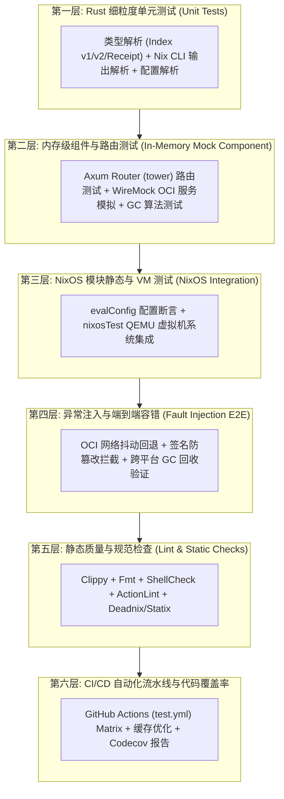
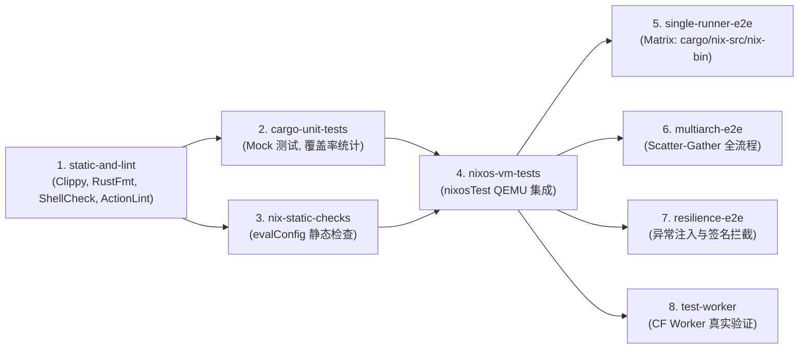

# nixcache-oci 全面测试覆盖与质量保障体系设计实现方案

> **设计文档状态**：已规划（待执行）  
> **适用版本**：Rust 2024 Edition / NixOS (npins 管理)  
> **关联文件**：[.github/workflows/test.yml](file:///root/workspace/.github/workflows/test.yml)、[README.md](file:///root/workspace/README.md)、[docs/npins/testing.md](file:///root/workspace/docs/npins/testing.md)

---

## 1. 现状评估与测试盲区分析

### 1.1 现有测试体系概览

当前项目的测试流程主要依赖于 [.github/workflows/test.yml](file:///root/workspace/.github/workflows/test.yml)，包含以下环节：
1. **基础 Rust 检查**：运行 `cargo clippy` 及 `cargo test`。
2. **端到端集成测试**：
   - [test-e2e.sh](file:///root/workspace/test/test-e2e.sh)：测试单机 All-in-One 模式（Matrix 支持 cargo/nix-source/nix-bin 与 flake/legacy）。
   - [test-multiarch-e2e.sh](file:///root/workspace/test/test-multiarch-e2e.sh)：测试 Scatter-Gather 多架构并发构建、Receipts 合并、Schema v2 发布与 GC 试运行。
   - [test-worker.sh](file:///root/workspace/test/test-worker.sh)：针对 Cloudflare Worker 的真实端到端测试。

### 1.2 关键测试盲区与质量风险

| 领域 | 现状 | 潜在风险与测试短板 |
|---|---|---|
| **Rust 单元/组件测试** | 仅有 5 个基础序列化测试 | 缺乏对 HTTP Mock、Axum Router 内存级请求测试、OCI 状态机解析、Nix CLI 解析以及 GC 图遍历算法的深度单测覆盖。 |
| **NixOS 模块测试 (VM Test)** | **完全缺失** | 尽管项目提供了 [nix/module.nix](file:///root/workspace/nix/module.nix) 系统服务模块，但未遵循 [docs/npins/testing.md](file:///root/workspace/docs/npins/testing.md) 编写 `evalConfig` 静态检查及 `nixosTest` 虚拟机启动测试，无法自动验证 systemd 单元配置、动态用户权限（DynamicUser）、缓存目录生成以及 Nix substituter 替换行为。 |
| **异常注入与容错 (Resilience)** | 仅覆盖 Happy Path | 缺少当 GHCR/OCI Registry 遭遇网络超时、HTTP 429/500/503 限流、上游故障、非合法签名包拦截时的异常处理验证。 |
| **静态代码与脚本质量** | 仅有 Clippy | 缺乏对 Shell 脚本（[scripts/](file:///root/workspace/scripts)、[test/](file:///root/workspace/test)）的 `shellcheck`，以及针对 GitHub Actions 工作流（[.github/workflows/](file:///root/workspace/.github/workflows)）与 Composite Actions（[action.yml](file:///root/workspace/action.yml) 等）的 `actionlint` 静态检查。 |
| **测试效率与缓存利用** | CI 每次全量构建 | CI 缺少针对 Nix Store 与 Cargo 构建缓存的细粒度复用，各 Matrix 任务间存在重复编译。 |

---

## 2. 测试体系分层架构设计（Testing Pyramid）

为了实现 90%+ 的代码与分支覆盖率，并确保在各种生产部署场景（本地 CLI、NixOS 守护进程、GitHub Actions、Cloudflare Workers）下的高可靠性，设计如下六层测试金字塔：



---

## 3. 具体实现方案设计

### 3.1 第一层 & 第二层：Rust 单元与组件 Mock 测试体系

#### (1) `crates/nixcache-oci` 扩展
- **目标**：覆盖 OCI Manifest、Blob 上传分块协议、Token 交换与 IndexSchema v1/v2 迁移兼容。
- **重点测试用例**：
  1. `test_schema_v1_to_v2_migration`：验证从 Schema v1 索引格式读取后升级至 v2 并保留全部 entries 的能力。
  2. `test_receipt_merging_and_deduplication`：验证多架构 Receipts 汇聚时的去重、合并与 GC Roots 字典结构。
  3. `test_oci_client_token_exchange_mock`：使用 `wiremock` 模拟 GitHub Container Registry 的 OAuth2 Token 请求与 Bearer 认证流。
  4. `test_blob_layer_digest_computation`：验证 SHA256 与 NAR Hash 互转与校验逻辑。

#### (2) `crates/nixcache-proxy` 扩展
- **目标**：不启动真实网络端口，利用 `tower::ServiceExt` 对 Axum Router 进行零延迟内存级 HTTP 请求断言。
- **重点测试用例**：
  1. `test_serve_cache_info`：断言 `/nix-cache-info` 返回 `StoreDir: /nix/store\nWantMassQuery: 1\nPriority: 40\n` 及对应 MIME 类型。
  2. `test_serve_public_key`：测试存在公钥时返回 200 与公钥文本，未配置时返回 404。
  3. `test_serve_status`：验证 `/_status` JSON 数据结构。
  4. `test_narinfo_hit_local_and_miss_upstream_fallback`：测试本地命中直接返回；本地未命中时请求 upstream（通过 WireMock 模拟 upstream 200 与 404 返回）。
  5. `test_nar_streaming_and_redirect`：测试请求 `/nar/{nar_name}` 时 OCI Blob 的流式重定向与 Content-Length 头部。
  6. `test_index_ttl_and_read_through`：测试 TTL 过期后触发后台懒加载刷新。

#### (3) `crates/nixcache-builder` 扩展
- **目标**：隔离真实 Nix CLI 执行，针对拓扑图遍历、Receipt 合并及 Nix 配置文件修改进行单测。
- **重点测试用例**：
  1. `test_gc_reachability_graph_algorithm`：构造复杂有向无环图（多个架构共享基础运行时，部分衍生包孤立），验证 GC 标记清除算法能精确识别待删除 blob。
  2. `test_gc_retention_time_window`：验证处于 `retention_days` 保护期内的条目不被误删除。
  3. `test_write_nix_conf_fallback_and_restore`：测试在无法写入 `/etc/nix/nix.conf` 时自动切换至 `~/.config/nix/nix.conf`，并验证退出时原始内容能够 100% 幂等恢复。
  4. `test_nix_cli_output_parsing`：解析 `nix path-info --json` 与 `nix show-derivation` 模拟输出。

#### (4) `crates/nixcache-worker` 扩展
- **目标**：验证 Cloudflare Workers Wasm 环境下的逻辑健壮性。
- **重点测试用例**：
  1. `test_worker_upstream_parsing`：测试包含空格、逗号、空字符串等多种 `NIXCACHE_UPSTREAM` 配置格式的解析。
  2. `test_worker_kv_chunking_and_compression`：针对超大索引进行拆分存储与组装还原的单元测试。

---

### 3.2 第三层：Nix 评估与 NixOS 虚拟机测试 (Nix Integration & VM Test)

遵循 [docs/npins/testing.md](file:///root/workspace/docs/npins/testing.md) 规范，在项目中建立标准的 Nix 测试套件。

#### (1) 静态评估检查：`nix/tests/static.nix`
**测试目标**：验证 NixOS 模块在不同配置下的选项能够正确合并为 systemd 与 nix.conf 配置。
```nix
{ pkgs ? import (import ../../npins).nixpkgs { } }:
let
  lib = pkgs.lib;
  evalModule = config:
    import (pkgs.path + "/nixos/lib/eval-config.nix") {
      inherit pkgs;
      modules = [
        ../module.nix
        config
      ];
    };
in
pkgs.runCommand "nixcache-module-static-check" { } ''
  # 1. 验证默认配置关闭
  ${let eval = evalModule { }; in ''
    [[ "${toString eval.config.services.nixcache-proxy.enable}" == "false" ]] || exit 1
  ''}

  # 2. 验证开启后的端口与环境参数传递
  ${let
    eval = evalModule {
      services.nixcache-proxy = {
        enable = true;
        repo = "test-owner/test-repo";
        port = 38000;
        listenAddress = "0.0.0.0";
        publicKey = "test-key:AAAA=";
      };
    };
  in ''
    [[ "${eval.config.systemd.services.nixcache-proxy.environment.NIXCACHE_REPO}" == "test-owner/test-repo" ]] || exit 1
    [[ "${eval.config.systemd.services.nixcache-proxy.environment.NIXCACHE_PORT}" == "38000" ]] || exit 1
    [[ "${eval.config.systemd.services.nixcache-proxy.environment.NIXCACHE_LISTEN}" == "0.0.0.0" ]] || exit 1
    [[ "${builtins.head eval.config.nix.settings.extra-trusted-public-keys}" == "test-key:AAAA=" ]] || exit 1
  ''}
  touch $out
''
```

#### (2) NixOS VM 虚拟机运行测试：`nix/tests/vmtest.nix`
**测试目标**：在真实的 QEMU 虚拟机中启动完整 NixOS，验证系统服务运行、权限沙箱、本地 Substituter 请求与签名验证。
```nix
{ pkgs ? import (import ../../npins).nixpkgs { } }:
pkgs.testers.nixosTest {
  name = "nixcache-proxy-service-vmtest";

  nodes.machine = { config, pkgs, ... }: {
    imports = [ ../module.nix ];

    services.nixcache-proxy = {
      enable = true;
      repo = "shaogme/nixcache-oci";
      port = 37515;
      requireSignatures = false;
    };
  };

  testScript = ''
    machine.wait_for_unit("multi-user.target")
    # 1. 等待 nixcache-proxy 服务启动就绪
    machine.wait_for_unit("nixcache-proxy.service")
    # 2. 验证端口监听
    machine.wait_for_open_port(37515)
    # 3. 验证 /nix-cache-info 接口响应
    output = machine.succeed("curl -fs http://127.0.0.1:37515/nix-cache-info")
    assert "StoreDir: /nix/store" in output
    # 4. 验证 DynamicUser 沙箱缓存目录权限
    machine.succeed("ls -la /var/cache/nixcache-proxy")
  '';
}
```

---

### 3.3 第四层：端到端与异常注入测试 (Resilience E2E)

在 [test/](file:///root/workspace/test) 目录下新增或增强以下测试脚本：

1. **异常与回退测试：`test/test-fault-tolerance.sh`**
   - **Registry 异常模拟**：启动 `mock_registry.py` 并注入延迟、返回 HTTP 500/503。
   - **验证代理行为**：确认 `nixcache-proxy` 优雅降级并转向 `NIXCACHE_UPSTREAM`（如 `cache.nixos.org`），不出现 Panic 或进程崩溃。
2. **签名安全拦截测试：`test/test-security-signature.sh`**
   - **篡改测试**：在 Mock Registry 中故意修改已缓存的 NAR 包内容或签名。
   - **客户端拦截**：运行 `nix-store --realise` 时，验证 Nix 客户端会因为签名不匹配或 Hash 校验失败而拒绝安装，确保供应链安全。
3. **并发合并冲突测试：`test/test-concurrency-merge.sh`**
   - 模拟 10 个以上 Matrix Worker 节点同时生成包含部分交集 package 的 Receipts，运行 `nixcache-builder merge`，验证合并操作的幂等性与最终一致性。

---

### 3.4 第五层：静态质量与规范检查 (Static Quality & Linters)

引入多维度代码静态分析：
1. **Rust 代码风格与安全**：`cargo fmt --check` + `cargo clippy --workspace --all-targets -- -D warnings`
2. **Shell 脚本规范**：使用 `shellcheck` 检查所有 `scripts/*.sh` 和 `test/*.sh`。
3. **GitHub Actions 规范**：使用 `actionlint` 检查 `.github/workflows/*.yml` 及所有 Composite Action 定义文件（[action.yml](file:///root/workspace/action.yml)、[build/action.yml](file:///root/workspace/build/action.yml)、[merge/action.yml](file:///root/workspace/merge/action.yml)）。
4. **Nix 规范检查**：使用 `deadnix` 与 `statix` 检查未使用的 Nix 变量及潜在语法反模式。

---

### 3.5 第六层：GitHub Actions 工作流优化与重构方案

针对 [.github/workflows/test.yml](file:///root/workspace/.github/workflows/test.yml) 进行结构化重组：



#### 工作流配置文件结构设计 (`.github/workflows/test.yml`)
1. **`lint-and-format`**：
   - 工具：`dtolnay/rust-toolchain` (clippy, rustfmt), `rhysd/actionlint`, `koalaman/shellcheck-action`。
2. **`unit-and-coverage`**：
   - 安装 `cargo-llvm-cov`，执行 `cargo llvm-cov --workspace --all-features --lcov --output-path lcov.info`。
   - 上传覆盖率产物至 GitHub Actions Artifacts / Codecov。
3. **`nix-evaluation-and-vm`**：
   - 安装 Nix 并启用 `nix-command flakes`。
   - 运行 `nix-build nix/tests/static.nix`。
   - 运行 `nix-build nix/tests/vmtest.nix`。
4. **`e2e-matrix`**：
   - 矩阵并发运行 `test-e2e.sh`、`test-multiarch-e2e.sh`、`test-fault-tolerance.sh`。
5. **`test-worker`**（保持原有条件触发机制）。

---

### 3.6 第七层：README.md 文档完善规划

在 [README.md](file:///root/workspace/README.md) 中增加专门的「🧪 测试与质量保障（Testing & QA）」章节，内容包括：
1. **测试架构说明**：展示测试分层结构（单元测试、静态检查、VM 测试、E2E 测试）。
2. **开发者本地运行指南**：
   - 快速运行 Rust 单元测试：`cargo test --workspace`
   - 运行 Nix 静态检查：`nix-build nix/tests/static.nix`
   - 运行 NixOS 虚拟机测试：`nix-build nix/tests/vmtest.nix`
   - 交互式调试 VM 驱动：`nix-build nix/tests/vmtest.nix -A driver && ./result/bin/nixos-test-driver`
   - 本地运行全套 E2E 容器测试：`./test/test-e2e.sh cargo flake`
3. **代码覆盖率与 CI 状态说明**。

---

## 4. 实施阶段与路线图 (Implementation Roadmap)

| 阶段 | 主要任务 | 预期交付物 |
|---|---|---|
| **Phase 1: 单测与组件 Mock 强化** | 1. 引入 `wiremock` 与 `tower` 依赖<br>2. 补充 `nixcache-oci`、`nixcache-proxy`、`nixcache-builder` 核心算法单测 | 单元测试用例从 5 个扩充至 35+ 个，覆盖核心路由与算法 |
| **Phase 2: NixOS 模块静态与 VM 测试** | 1. 编写 `nix/tests/static.nix`<br>2. 编写 `nix/tests/vmtest.nix`<br>3. 暴露测试入口于 `default.nix` 与 `flake.nix` | 自动化验证 NixOS 模块生命周期与 systemd 服务 |
| **Phase 3: 异常注入与容错测试** | 1. 编写 `test/test-fault-tolerance.sh`<br>2. 编写 `test/test-security-signature.sh`<br>3. 编写 `test/test-concurrency-merge.sh` | 建立健壮的抗故障与安全防篡改自动化测试 |
| **Phase 4: CI 流水线重构与文档同步** | 1. 重构 [.github/workflows/test.yml](file:///root/workspace/.github/workflows/test.yml)<br>2. 集成 `actionlint`、`shellcheck`、`cargo-llvm-cov`<br>3. 更新 [README.md](file:///root/workspace/README.md) 测试章节 | 完整的 CI/CD 防护网与规范的开发测试文档 |

---

## 5. 方案总结

本方案严格遵循 **Rust 2024 Edition**、**npins 规范** 以及 **NixOS 测试最佳实践**，针对 `nixcache-oci` 的多平台、分布式 Scatter-Gather 架构建立了从“微观单元与算法”到“系统级虚拟机与跨平台 E2E”的完整质量防护网。方案当前已完成详尽设计并记录在此，待后续按阶段执行落地。
