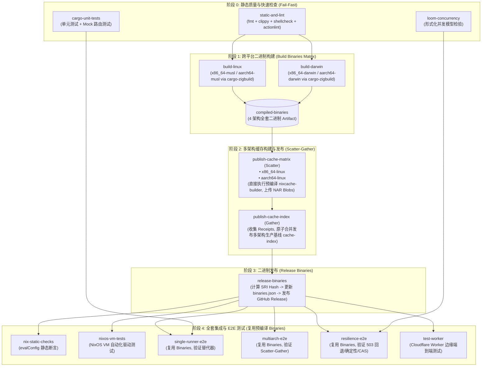

# NixCache OCI 工作流三合一与多架构发布重构设计方案

## 一、 背景与重构动机

### 1.1 现状诊断与核心痛点

当前仓库在 `.github/workflows/` 下维护了三个独立且功能重叠的工作流文件：
1. **`.github/workflows/publish-cache.yml`**：用于发布 Nix 二进制缓存。
2. **`.github/workflows/release-binaries.yml`**：用于跨平台编译预编译二进制（Linux/macOS 4 架构）、创建 GitHub Release 并更新 `nix/binaries.json`。
3. **`.github/workflows/test.yml`**：用于运行静态检查、单元测试、Loom 形式化验证、NixOS VM 测试、E2E 测试与容错测试。

这种分散的多文件架构在实际运行中暴露出以下严重缺陷：

1. **严重的重复编译与 CI 资源浪费**：
   - `release-binaries.yml` 已经使用 `cargo-zigbuild` 完整构建了 4 种架构的 `nixcache-proxy` 与 `nixcache-builder` 优化二进制。
   - 然而，`test.yml` 中的多个 Job（如 `single-runner-e2e`、`multiarch-e2e`、`resilience-e2e`）在测试脚本内部又反复执行 `cargo build --workspace` 或 `cargo build --bin ...`。
   - `publish-cache.yml` 也在独立环境中重复拉取或编译工具链。单次提交导致相同的 Rust 代码在各个 Job 中被重复编译 8~10 次，极大拖慢 CI 反馈速度并消耗 GitHub Actions 配额。

2. **缓存发布未利用多架构并行（仍为单架构发布）**：
   - 现有的 `publish-cache.yml` 是单一 `ubuntu-latest` 节点上的单机发布流程，仅发布当前主机的单架构（`x86_64-linux`）缓存。
   - 随着多架构 Scatter-Gather 架构与 Schema v4 的落地，项目已具备并发构建并原子汇聚多架构索引的能力。既然 CI 中已经具备跨架构构建能力，生产缓存应直接以多架构形态发布，不再发布单一架构缓存。

3. **流水线时序脱节与依赖竞态**：
   - 现有的 3 个工作流由 `push` 事件同时并发触发，缺乏严格的因果依赖关系。可能出现二进制已 Release 但测试尚未通过，或者测试运行的二进制并非最终发布的二进制产物等“测试脱节”风险。

4. **用户使用引导过时（Fork 模式违背当前最佳实践）**：
   - `README.md` 中仍保留了“方式二：Fork 本项目（声明式管理）”的指引。
   - 实际上，`nixcache-oci` 现已提供成熟的官方 GitHub Actions（`build`、`promote`、`setup`、`capture`、`install`）和 NixOS 模块，用户只需在自己的仓库中直接引用 Action 即可，不再建议用户 Fork 本仓库。Fork 模式不仅增加维护负担，还容易因同步滞后导致版本混乱。

---

## 二、 重构核心原则与目标

1. **单一流水线收敛（Single Pipeline Convergence）**：
   - 彻底废除并删除 `publish-cache.yml`、`release-binaries.yml`、`test.yml` 3 个分散文件。
   - 合并为单一工作流 `.github/workflows/ci.yml`（或 `.github/workflows/pipeline.yml`），由顶层严格掌控执行时序与权限。

2. **严格且确定的执行时序（Deterministic Execution Flow）**：
   - **阶段 0：静态质量与源码快速检查（Fail Fast）**（< 1 分钟快速拦截代码风格、Clippy、ActionLint 问题）。
   - **阶段 1：跨平台矩阵构建（Build Binaries Matrix）**（针对 Linux x86_64/ARM64 及 macOS x86_64/ARM64 并行构建，产出 4 架构全套二进制）。
   - **阶段 2：多架构缓存构建与原子发布（Publish Multi-Arch Cache - Scatter-Gather）**（直接使用阶段 1 产物，Matrix 并行构建多架构 Nix 产物推送到 GHCR，单节点原子合并发布多架构生产基线 `cache-index`）。
   - **阶段 3：二进制发布（Release Binaries）**（基于阶段 1 产物计算哈希、创建 GitHub Release、更新 `nix/binaries.json`）。
   - **阶段 4：执行全套测试（Integration & E2E Tests）**（所有测试 Job **直接复用阶段 1 构建出的二进制**，测试脚本彻底跳过 `cargo build`，实现真正的端到端实物验证与零重复构建）。

3. **破坏性重构优先（Breaking Refactor Allowed & Preferred）**：
   - 全面清理旧有的单机缓存发布逻辑。
   - 重构 `test/*.sh` 测试脚本的二进制探测逻辑：支持环境变量与 PATH 注入，彻底消除测试脚本中的硬编码 `cargo build`。
   - 彻底移除 `README.md` 中的 Fork 章节与描述。

---

## 三、 合并后流水线 DAG 拓扑架构



---

## 四、 详细阶段设计与实现规格

### 4.1 阶段 0：静态质量与源码快速检查 (Fail-Fast)
- **目标**：在 1 分钟内快速发现格式、代码规范、Shell 语法或 GitHub Action 语法错误，避免在有明显语法错误的代码上浪费多架构编译资源。
- **包含 Job**：
  1. `static-and-lint`：运行 `cargo fmt --check`、`cargo clippy --workspace --all-targets -- -D warnings`、`shellcheck` 与 `actionlint`。
  2. `cargo-unit-tests`：运行 `cargo test --workspace --verbose`（内存级 WireMock 单元测试）。
  3. `loom-concurrency`：运行 `RUSTFLAGS="--cfg loom" cargo test -p nixcache-oci --features loom --test token_loom`（CAS 状态机并发模型检查）。

---

### 4.2 阶段 1：跨平台二进制矩阵构建 (Build Binaries Matrix)
- **目标**：为所有支持的 4 大平台生成静态/动态链接的优化二进制产物，并上传为统一的 Action Artifact `compiled-binaries`。
- **矩阵规划**：
  - **Linux 矩阵（`ubuntu-latest`）**：
    - `x86_64-unknown-linux-musl` -> `nixcache-proxy-x86_64-linux`、`nixcache-builder-x86_64-linux`
    - `aarch64-unknown-linux-musl` -> `nixcache-proxy-aarch64-linux`、`nixcache-builder-aarch64-linux`
  - **macOS 矩阵（`macos-latest`）**：
    - `x86_64-apple-darwin` -> `nixcache-proxy-x86_64-darwin`、`nixcache-builder-x86_64-darwin`
    - `aarch64-apple-darwin` -> `nixcache-proxy-aarch64-darwin`、`nixcache-builder-aarch64-darwin`
- **构建工具链**：`dtolnay/rust-toolchain` + `cargo-zigbuild` + `setup-zig`。
- **产物归集**：
  - 各构建 Job 将重命名后的二进制统一上传到 `compiled-binaries`（merge-multiple / 统一命名）。

---

### 4.3 阶段 2：多架构缓存构建与原子发布 (Scatter-Gather)
- **核心变更**：彻底废弃单一架构单机发布，全面采用 Scatter-Gather 多架构并行流水线。
- **直接复用构建产物**：Job 启动时直接下载 `compiled-binaries` 中对应平台的 `nixcache-builder` 和 `nixcache-proxy`，注入到 `$PATH`，**零编译开销直接运行**！

#### A. Scatter 阶段 (`publish-cache-matrix`)
- **矩阵架构**：
  - `system: x86_64-linux`, `os: ubuntu-latest`
  - `system: aarch64-linux`, `os: ubuntu-24.04-arm`（若平台无原生 ARM runner，可配置 QEMU 或使用 Linux-x86 跨平台交叉评估）
- **核心执行步骤**：
  1. 下载 `compiled-binaries` 对应架构的可执行文件并 `chmod +x`。
  2. 提取并配置 `NIX_SIGNING_KEY`。
  3. 执行 `nixcache-builder build`：
     ```bash
     nixcache-builder build \
       --system "${{ matrix.system }}" \
       --mode flake \
       --flake-path examples/flake \
       --output-receipt "$RUNNER_TEMP/receipt-${{ matrix.system }}.json" \
       --strict
     ```
  4. 上传收据产物 `nixcache-receipt-${{ matrix.system }}`。

#### B. Gather 阶段 (`publish-cache-index`)
- **运行节点**：`ubuntu-latest`（单节点 Coordinator）。
- **依赖**：`publish-cache-matrix`。
- **核心执行步骤**：
  1. 下载 `compiled-binaries` 中的 `x86_64-linux` 二进制。
  2. 下载所有 Matrix 节点生成的 `nixcache-receipt-*`。
  3. 执行原子合并与基线发布：
     ```bash
     nixcache-builder promote \
       --receipts-dir "$RUNNER_TEMP/receipts" \
       --repo "${{ github.repository }}" \
       --registry ghcr.io \
       --target-tag cache-index
     ```
  4. 产出：GHCR 上的 `cache-index` 成为包含多架构完整闭包与 GC Roots 的 Schema v4 生产基线。

---

### 4.4 阶段 3：二进制发布 (Release Binaries)
- **执行条件**：
  - `github.ref == 'refs/heads/main'` 或 `startsWith(github.ref, 'refs/tags/v')`
  - 依赖阶段 2 `publish-cache-index` 成功。
- **核心执行步骤**：
  1. 下载 `compiled-binaries`（包含 4 架构全部 8 个二进制文件）。
  2. 计算 SRI SHA256 哈希值（`sha256-<base64>`）。
  3. 比对 `nix/binaries.json`：
     - 若全部一致：标记 `skip=true`，无需重复打 Release。
     - 若发生变更：
       - 利用 `jq` 更新 `nix/binaries.json`（更新 `version`、各架构的 `hash` 及 `url`）。
       - 调用 `softprops/action-gh-release` 创建 Release（tag: `bin-${{ github.sha }}`），上传 8 个二进制资产。
       - 提交并推送 `nix/binaries.json` 修改（commit message: `chore: update pre-compiled binary hashes [skip ci]`）。

---

### 4.5 阶段 4：执行全套测试（测试脚本零重复编译改造）
- **核心改进**：
  - 所有的测试 Job 在执行前均下载 `compiled-binaries`，将目标架构二进制放入工作区或指定目录。
  - 改造所有 `test/*.sh` 测试脚本，增加优先使用已存在二进制的逻辑。
  - 测试直接针对经过 Release 验证的二进制文件运行（Dogfooding），消除“本地 cargo debug 与生产 release 二进制不一致”的隐患。

#### 测试 Job 分布：
1. **`nix-static-checks`**：
   - 验证 NixOS 模块的 `evalConfig` 静态配置断言。
2. **`nixos-vm-tests`**：
   - 运行 QEMU VM 虚拟机自动化测试（验证 systemd 服务生命周期与端口通信）。
3. **`single-runner-e2e`**：
   - 针对 `cargo`、`nix-source`、`nix-bin` 模式验证 Nix 替代器（substituters）下载与完整性链路。
4. **`multiarch-e2e`**：
   - 运行 `test/test-multiarch-e2e.sh`，复用预编译二进制验证 2 节点 Scatter-Gather 汇聚与 GC。
5. **`resilience-e2e`**：
   - 依次运行 OCI 多后端确定性测试、503 故障注入容错测试、签名防篡改拦截测试、12 节点并发合并测试、Session CAS 级联测试、Purge 物理删除测试与 install action 测试。
6. **`test-worker`**：
   - 运行 Cloudflare Worker 边缘代理测试。

---

## 五、 测试脚本统一二进制发现机制改造方案

为了彻底消除测试脚本在 CI 期间调用 `cargo build`，对 `test/*.sh` 中的脚本进行统一改造。

### 5.1 统一二进制发现标准实现

在每个测试脚本中（或提取公共函数），将原有的：
```bash
# 改造前（硬编码编译，浪费时间）：
echo ">>> Building cargo workspace..."
cargo build --workspace
BUILDER_BIN="./target/debug/nixcache-builder"
PROXY_BIN="./target/debug/nixcache-proxy"
```

统一重构为破坏性的**优先级二进制探测器**：
```bash
# 改造后（支持预编译注入，零重复编译）：
find_binaries() {
    # 1. 优先使用显式环境变量指定
    if [[ -n "${BUILDER_BIN:-}" && -x "$BUILDER_BIN" && -n "${PROXY_BIN:-}" && -x "$PROXY_BIN" ]]; then
        echo ">>> Using binaries from environment variables: BUILDER_BIN=$BUILDER_BIN, PROXY_BIN=$PROXY_BIN"
        return 0
    fi

    # 2. 检查 PRECOMPILED_BIN_DIR 预编译产物目录
    if [[ -n "${PRECOMPILED_BIN_DIR:-}" && -x "$PRECOMPILED_BIN_DIR/nixcache-builder" && -x "$PRECOMPILED_BIN_DIR/nixcache-proxy" ]]; then
        BUILDER_BIN="$PRECOMPILED_BIN_DIR/nixcache-builder"
        PROXY_BIN="$PRECOMPILED_BIN_DIR/nixcache-proxy"
        echo ">>> Using precompiled binaries from $PRECOMPILED_BIN_DIR"
        return 0
    fi

    # 3. 检查系统 PATH 中是否已存在
    if command -v nixcache-builder &>/dev/null && command -v nixcache-proxy &>/dev/null && [[ "${FORCE_BUILD:-false}" != "true" ]]; then
        BUILDER_BIN="$(command -v nixcache-builder)"
        PROXY_BIN="$(command -v nixcache-proxy)"
        echo ">>> Using binaries found in PATH: $BUILDER_BIN, $PROXY_BIN"
        return 0
    fi

    # 4. 本地开发者环境回退：调用 cargo build
    echo ">>> No pre-compiled binaries found. Building cargo workspace..."
    cargo build --workspace
    BUILDER_BIN="./target/debug/nixcache-builder"
    PROXY_BIN="./target/debug/nixcache-proxy"
}

find_binaries
```

### 5.2 受影响并需适配的测试脚本清单
1. `test/test-e2e.sh`
2. `test/test-multiarch-e2e.sh`
3. `test/test-backends-determinism.sh`
4. `test/test-fault-tolerance.sh`
5. `test/test-security-signature.sh`
6. `test/test-concurrency-merge.sh`
7. `test/test-pipeline-session-cas.sh`
8. `test/test-purge-cas.sh`

在 CI 的 `resilience-e2e` 与 `multiarch-e2e` 中，只需在 Step 中执行：
```bash
export PRECOMPILED_BIN_DIR="$PWD/dist-x86_64-linux"
export PATH="$PRECOMPILED_BIN_DIR:$PATH"
```
所有测试脚本将以 **0 秒构建时间** 直接启动测试。

---

## 六、 合并后的完整工作流 YAML 规格定义

合并后的单一文件为 `.github/workflows/ci.yml`（或 `.github/workflows/pipeline.yml`）：

```yaml
name: CI, Build & Release Pipeline

on:
  push:
    branches: [main]
    tags: ['v*']
    paths-ignore:
      - 'nix/binaries.json'
      - '**.md'
  pull_request:
    branches: [main]
    paths-ignore:
      - '**.md'
  workflow_dispatch:

permissions:
  contents: write
  packages: write

jobs:
  # =========================================================================
  # 阶段 0: 静态质量与快速检查 (Fail-Fast)
  # =========================================================================
  static-and-lint:
    name: 0. Static Quality & Lint
    runs-on: ubuntu-latest
    steps:
      - uses: actions/checkout@main

      - name: Install Rust Toolchain
        uses: dtolnay/rust-toolchain@stable
        with:
          components: clippy, rustfmt

      - name: Cargo Cache
        uses: actions/cache@main
        with:
          path: |
            ~/.cargo/bin/
            ~/.cargo/registry/index/
            ~/.cargo/registry/cache/
            ~/.cargo/git/db/
            target/
          key: ${{ runner.os }}-cargo-lint-${{ hashFiles('**/Cargo.lock') }}
          restore-keys: ${{ runner.os }}-cargo-lint-

      - name: Rust Code Format Check
        run: cargo fmt --check

      - name: Clippy Linter Check
        run: cargo clippy --workspace --all-targets -- -D warnings

      - name: Run ShellCheck
        uses: ludeeus/action-shellcheck@master
        with:
          scandir: "./scripts ./test ./install"

      - name: Run ActionLint
        uses: raven-actions/actionlint@v2

  cargo-unit-tests:
    name: 0. Cargo Workspace Unit Tests
    runs-on: ubuntu-latest
    needs: static-and-lint
    steps:
      - uses: actions/checkout@main

      - name: Install Rust Toolchain
        uses: dtolnay/rust-toolchain@stable

      - name: Cargo Cache
        uses: actions/cache@main
        with:
          path: |
            ~/.cargo/bin/
            ~/.cargo/registry/index/
            ~/.cargo/registry/cache/
            ~/.cargo/git/db/
            target/
          key: ${{ runner.os }}-cargo-unit-${{ hashFiles('**/Cargo.lock') }}
          restore-keys: ${{ runner.os }}-cargo-unit-

      - name: Run Cargo Unit & Mock Tests
        run: cargo test --workspace --verbose

  loom-concurrency:
    name: 0. Loom Formal Concurrency Model Checking
    runs-on: ubuntu-latest
    needs: static-and-lint
    steps:
      - uses: actions/checkout@main

      - name: Install Rust Toolchain
        uses: dtolnay/rust-toolchain@stable

      - name: Run Loom Tests
        run: RUSTFLAGS="--cfg loom" cargo test -p nixcache-oci --features loom --test token_loom -- --nocapture

  # =========================================================================
  # 阶段 1: 跨平台二进制矩阵构建 (Build Binaries Matrix)
  # =========================================================================
  build-linux-binaries:
    name: 1. Build Linux Binaries (${{ matrix.target }})
    runs-on: ubuntu-latest
    needs: [static-and-lint]
    strategy:
      fail-fast: false
      matrix:
        target:
          - x86_64-unknown-linux-musl
          - aarch64-unknown-linux-musl
    steps:
      - uses: actions/checkout@main

      - name: Install Rust Toolchain
        uses: dtolnay/rust-toolchain@stable
        with:
          targets: ${{ matrix.target }}

      - name: Install Zig
        uses: mlugg/setup-zig@v2

      - name: Install cargo-zigbuild
        run: pip install cargo-zigbuild

      - name: Build Binaries
        run: |
          cargo zigbuild --release --target ${{ matrix.target }} --bin nixcache-proxy
          cargo zigbuild --release --target ${{ matrix.target }} --bin nixcache-builder

      - name: Prepare Artifact
        run: |
          mkdir -p dist
          if [ "${{ matrix.target }}" = "x86_64-unknown-linux-musl" ]; then
            cp target/${{ matrix.target }}/release/nixcache-proxy dist/nixcache-proxy-x86_64-linux
            cp target/${{ matrix.target }}/release/nixcache-builder dist/nixcache-builder-x86_64-linux
          else
            cp target/${{ matrix.target }}/release/nixcache-proxy dist/nixcache-proxy-aarch64-linux
            cp target/${{ matrix.target }}/release/nixcache-builder dist/nixcache-builder-aarch64-linux
          fi

      - name: Upload Linux Binary Artifact
        uses: actions/upload-artifact@v4
        with:
          name: binary-${{ matrix.target }}
          path: dist/*
          retention-days: 1
          overwrite: true

  build-darwin-binaries:
    name: 1. Build macOS Binaries (${{ matrix.target }})
    runs-on: macos-latest
    needs: [static-and-lint]
    strategy:
      fail-fast: false
      matrix:
        target:
          - x86_64-apple-darwin
          - aarch64-apple-darwin
    steps:
      - uses: actions/checkout@main

      - name: Install Rust Toolchain
        uses: dtolnay/rust-toolchain@stable
        with:
          targets: ${{ matrix.target }}

      - name: Install Zig
        uses: mlugg/setup-zig@v2

      - name: Install cargo-zigbuild
        run: pip install cargo-zigbuild

      - name: Build Binaries
        run: |
          cargo zigbuild --release --target ${{ matrix.target }} --bin nixcache-proxy
          cargo zigbuild --release --target ${{ matrix.target }} --bin nixcache-builder

      - name: Prepare Artifact
        run: |
          mkdir -p dist
          if [ "${{ matrix.target }}" = "x86_64-apple-darwin" ]; then
            cp target/${{ matrix.target }}/release/nixcache-proxy dist/nixcache-proxy-x86_64-darwin
            cp target/${{ matrix.target }}/release/nixcache-builder dist/nixcache-builder-x86_64-darwin
          else
            cp target/${{ matrix.target }}/release/nixcache-proxy dist/nixcache-proxy-aarch64-darwin
            cp target/${{ matrix.target }}/release/nixcache-builder dist/nixcache-builder-aarch64-darwin
          fi

      - name: Upload Darwin Binary Artifact
        uses: actions/upload-artifact@v4
        with:
          name: binary-${{ matrix.target }}
          path: dist/*
          retention-days: 1
          overwrite: true

  # =========================================================================
  # 阶段 2: 多架构缓存构建与原子发布 (Scatter-Gather)
  # =========================================================================
  publish-cache-matrix:
    name: 2. Scatter Build Multi-Arch Cache (${{ matrix.system }})
    runs-on: ${{ matrix.os }}
    needs: [build-linux-binaries]
    strategy:
      fail-fast: false
      matrix:
        include:
          - os: ubuntu-latest
            system: x86_64-linux
            binary_target: x86_64-unknown-linux-musl
          - os: ubuntu-24.04-arm
            system: aarch64-linux
            binary_target: aarch64-unknown-linux-musl
    steps:
      - uses: actions/checkout@main

      - name: Install Nix
        uses: DeterminateSystems/nix-installer-action@main
        with:
          extra-conf: |
            experimental-features = nix-command flakes

      - name: Download Target Binaries
        uses: actions/download-artifact@v4
        with:
          name: binary-${{ matrix.binary_target }}
          path: ${{ runner.temp }}/bin

      - name: Setup Pre-compiled Binaries in PATH
        run: |
          chmod +x ${{ runner.temp }}/bin/*
          ln -sf "${{ runner.temp }}/bin/nixcache-builder-${{ matrix.system }}" "${{ runner.temp }}/bin/nixcache-builder"
          ln -sf "${{ runner.temp }}/bin/nixcache-proxy-${{ matrix.system }}" "${{ runner.temp }}/bin/nixcache-proxy"
          echo "${{ runner.temp }}/bin" >> "$GITHUB_PATH"

      - name: Setup Signing Key
        run: |
          if [[ -n "${{ secrets.NIX_SIGNING_KEY }}" ]]; then
            echo "${{ secrets.NIX_SIGNING_KEY }}" > "$RUNNER_TEMP/signing-key"
            echo "NIXCACHE_SIGNING_KEY_FILE=$RUNNER_TEMP/signing-key" >> "$GITHUB_ENV"
          fi

      - name: Log in to GHCR
        run: echo "${{ secrets.GITHUB_TOKEN }}" | docker login ghcr.io -u "${{ github.actor }}" --password-stdin

      - name: Build Outputs and Push NAR Blobs
        env:
          NIXCACHE_SYSTEM: ${{ matrix.system }}
          NIXCACHE_MODE: 'flake'
          NIXCACHE_FLAKE_PATH: 'examples/flake'
          NIXCACHE_REPO: ${{ github.repository }}
          NIXCACHE_REGISTRY: 'ghcr.io'
          NIXCACHE_STRICT: 'true'
          NIXCACHE_RUN_ID: ${{ github.run_id }}
          NIXCACHE_OUTPUT_RECEIPT: ${{ runner.temp }}/receipt-${{ matrix.system }}.json
          GITHUB_TOKEN: ${{ secrets.GITHUB_TOKEN }}
        run: |
          nixcache-builder build

      - name: Upload Receipt Artifact
        uses: actions/upload-artifact@v4
        with:
          name: nixcache-receipt-${{ matrix.system }}
          path: ${{ runner.temp }}/receipt-${{ matrix.system }}.json
          retention-days: 1
          overwrite: true

  publish-cache-index:
    name: 2. Gather & Promote Multi-Arch Cache Index
    runs-on: ubuntu-latest
    needs: [publish-cache-matrix, build-linux-binaries]
    steps:
      - uses: actions/checkout@main

      - name: Install Nix
        uses: DeterminateSystems/nix-installer-action@main
        with:
          extra-conf: |
            experimental-features = nix-command flakes

      - name: Download Linux x86_64 Binaries
        uses: actions/download-artifact@v4
        with:
          name: binary-x86_64-unknown-linux-musl
          path: ${{ runner.temp }}/bin

      - name: Setup Pre-compiled Binaries in PATH
        run: |
          chmod +x ${{ runner.temp }}/bin/*
          ln -sf "${{ runner.temp }}/bin/nixcache-builder-x86_64-linux" "${{ runner.temp }}/bin/nixcache-builder"
          ln -sf "${{ runner.temp }}/bin/nixcache-proxy-x86_64-linux" "${{ runner.temp }}/bin/nixcache-proxy"
          echo "${{ runner.temp }}/bin" >> "$GITHUB_PATH"

      - name: Download All Receipts
        uses: actions/download-artifact@v4
        with:
          pattern: 'nixcache-receipt-*'
          path: ${{ runner.temp }}/receipts
          merge-multiple: true

      - name: Log in to GHCR
        run: echo "${{ secrets.GITHUB_TOKEN }}" | docker login ghcr.io -u "${{ github.actor }}" --password-stdin

      - name: Promote Receipts & Publish Multi-Arch Index
        env:
          NIXCACHE_RUN_ID: ${{ github.run_id }}
          NIXCACHE_RECEIPTS_DIR: ${{ runner.temp }}/receipts
          NIXCACHE_TARGET_TAG: 'cache-index'
          NIXCACHE_REPO: ${{ github.repository }}
          NIXCACHE_REGISTRY: 'ghcr.io'
          GITHUB_TOKEN: ${{ secrets.GITHUB_TOKEN }}
        run: |
          nixcache-builder promote

  # =========================================================================
  # 阶段 3: 发布预编译二进制 (Release Pre-compiled Binaries)
  # =========================================================================
  release-binaries:
    name: 3. Release Pre-compiled Binaries
    runs-on: ubuntu-latest
    needs: [publish-cache-index, build-linux-binaries, build-darwin-binaries]
    if: github.ref == 'refs/heads/main' || startsWith(github.ref, 'refs/tags/v')
    steps:
      - uses: actions/checkout@main
        with:
          token: ${{ secrets.GITHUB_TOKEN }}

      - name: Download All Binaries
        uses: actions/download-artifact@v4
        with:
          pattern: 'binary-*'
          path: all-binaries
          merge-multiple: true

      - name: Calculate SRI Hashes and Check Updates
        id: calc_hashes
        run: |
          get_sri() {
            local file="$1"
            local b64
            b64=$(openssl dgst -sha256 -binary "$file" | openssl base64 | tr -d '\n')
            echo "sha256-$b64"
          }
          
          cd all-binaries
          HASH_PROXY_X86_64_LINUX=$(get_sri nixcache-proxy-x86_64-linux)
          HASH_PROXY_AARCH64_LINUX=$(get_sri nixcache-proxy-aarch64-linux)
          HASH_PROXY_X86_64_DARWIN=$(get_sri nixcache-proxy-x86_64-darwin)
          HASH_PROXY_AARCH64_DARWIN=$(get_sri nixcache-proxy-aarch64-darwin)

          HASH_BUILDER_X86_64_LINUX=$(get_sri nixcache-builder-x86_64-linux)
          HASH_BUILDER_AARCH64_LINUX=$(get_sri nixcache-builder-aarch64-linux)
          HASH_BUILDER_X86_64_DARWIN=$(get_sri nixcache-builder-x86_64-darwin)
          HASH_BUILDER_AARCH64_DARWIN=$(get_sri nixcache-builder-aarch64-darwin)
          cd ..

          OLD_PROXY_X86_64_LINUX=$(jq -r '.["nixcache-proxy"]."x86_64-linux".hash // empty' nix/binaries.json)
          OLD_PROXY_AARCH64_LINUX=$(jq -r '.["nixcache-proxy"]."aarch64-linux".hash // empty' nix/binaries.json)
          OLD_PROXY_X86_64_DARWIN=$(jq -r '.["nixcache-proxy"]."x86_64-darwin".hash // empty' nix/binaries.json)
          OLD_PROXY_AARCH64_DARWIN=$(jq -r '.["nixcache-proxy"]."aarch64-darwin".hash // empty' nix/binaries.json)

          OLD_BUILDER_X86_64_LINUX=$(jq -r '.["nixcache-builder"]."x86_64-linux".hash // empty' nix/binaries.json)
          OLD_BUILDER_AARCH64_LINUX=$(jq -r '.["nixcache-builder"]."aarch64-linux".hash // empty' nix/binaries.json)
          OLD_BUILDER_X86_64_DARWIN=$(jq -r '.["nixcache-builder"]."x86_64-darwin".hash // empty' nix/binaries.json)
          OLD_BUILDER_AARCH64_DARWIN=$(jq -r '.["nixcache-builder"]."aarch64-darwin".hash // empty' nix/binaries.json)

          if [ "$HASH_PROXY_X86_64_LINUX" = "$OLD_PROXY_X86_64_LINUX" ] && \
             [ "$HASH_PROXY_AARCH64_LINUX" = "$OLD_PROXY_AARCH64_LINUX" ] && \
             [ "$HASH_PROXY_X86_64_DARWIN" = "$OLD_PROXY_X86_64_DARWIN" ] && \
             [ "$HASH_PROXY_AARCH64_DARWIN" = "$OLD_PROXY_AARCH64_DARWIN" ] && \
             [ "$HASH_BUILDER_X86_64_LINUX" = "$OLD_BUILDER_X86_64_LINUX" ] && \
             [ "$HASH_BUILDER_AARCH64_LINUX" = "$OLD_BUILDER_AARCH64_LINUX" ] && \
             [ "$HASH_BUILDER_X86_64_DARWIN" = "$OLD_BUILDER_X86_64_DARWIN" ] && \
             [ "$HASH_BUILDER_AARCH64_DARWIN" = "$OLD_BUILDER_AARCH64_DARWIN" ]; then
            echo "All hashes match existing ones. Skipping release."
            echo "skip=true" >> "$GITHUB_OUTPUT"
            exit 0
          fi

          echo "skip=false" >> "$GITHUB_OUTPUT"
          SHA="${{ github.sha }}"
          URL_PREFIX="https://github.com/${{ github.repository }}/releases/download/bin-${SHA}"

          jq --arg ver "$SHA" \
             --arg px86_l "$HASH_PROXY_X86_64_LINUX" \
             --arg paarch_l "$HASH_PROXY_AARCH64_LINUX" \
             --arg px86_d "$HASH_PROXY_X86_64_DARWIN" \
             --arg paarch_d "$HASH_PROXY_AARCH64_DARWIN" \
             --arg bx86_l "$HASH_BUILDER_X86_64_LINUX" \
             --arg baarch_l "$HASH_BUILDER_AARCH64_LINUX" \
             --arg bx86_d "$HASH_BUILDER_X86_64_DARWIN" \
             --arg baarch_d "$HASH_BUILDER_AARCH64_DARWIN" \
             --arg url_prefix "$URL_PREFIX" \
             '.version = $ver |
              .["nixcache-proxy"]."x86_64-linux".hash = $px86_l |
              .["nixcache-proxy"]."x86_64-linux".url = ($url_prefix + "/nixcache-proxy-x86_64-linux") |
              .["nixcache-proxy"]."aarch64-linux".hash = $paarch_l |
              .["nixcache-proxy"]."aarch64-linux".url = ($url_prefix + "/nixcache-proxy-aarch64-linux") |
              .["nixcache-proxy"]."x86_64-darwin".hash = $px86_d |
              .["nixcache-proxy"]."x86_64-darwin".url = ($url_prefix + "/nixcache-proxy-x86_64-darwin") |
              .["nixcache-proxy"]."aarch64-darwin".hash = $paarch_d |
              .["nixcache-proxy"]."aarch64-darwin".url = ($url_prefix + "/nixcache-proxy-aarch64-darwin") |
              .["nixcache-builder"]."x86_64-linux".hash = $bx86_l |
              .["nixcache-builder"]."x86_64-linux".url = ($url_prefix + "/nixcache-builder-x86_64-linux") |
              .["nixcache-builder"]."aarch64-linux".hash = $baarch_l |
              .["nixcache-builder"]."aarch64-linux".url = ($url_prefix + "/nixcache-builder-aarch64-linux") |
              .["nixcache-builder"]."x86_64-darwin".hash = $bx86_d |
              .["nixcache-builder"]."x86_64-darwin".url = ($url_prefix + "/nixcache-builder-x86_64-darwin") |
              .["nixcache-builder"]."aarch64-darwin".hash = $baarch_d |
              .["nixcache-builder"]."aarch64-darwin".url = ($url_prefix + "/nixcache-builder-aarch64-darwin")' \
             nix/binaries.json > temp.json && mv temp.json nix/binaries.json

      - name: Create GitHub Release
        if: steps.calc_hashes.outputs.skip != 'true'
        uses: softprops/action-gh-release@v2
        with:
          tag_name: bin-${{ github.sha }}
          name: "Pre-compiled Binaries (${{ github.sha }})"
          prerelease: true
          files: |
            all-binaries/nixcache-proxy-x86_64-linux
            all-binaries/nixcache-proxy-aarch64-linux
            all-binaries/nixcache-proxy-x86_64-darwin
            all-binaries/nixcache-proxy-aarch64-darwin
            all-binaries/nixcache-builder-x86_64-linux
            all-binaries/nixcache-builder-aarch64-linux
            all-binaries/nixcache-builder-x86_64-darwin
            all-binaries/nixcache-builder-aarch64-darwin
        env:
          GITHUB_TOKEN: ${{ secrets.GITHUB_TOKEN }}

      - name: Commit and Push binary hashes
        if: steps.calc_hashes.outputs.skip != 'true'
        run: |
          git config --global user.name "github-actions[bot]"
          git config --global user.email "github-actions[bot]@users.noreply.github.com"
          git add nix/binaries.json
          if git diff --cached --quiet; then
            echo "No changes to binaries.json"
          else
            git commit -m "chore: update pre-compiled binary hashes [skip ci]"
            git push origin main
          fi

  # =========================================================================
  # 阶段 4: 全套集成测试 (直接复用已构建 Binaries，零重复编译)
  # =========================================================================
  nix-static-checks:
    name: 4. Nix Module Static Checks
    runs-on: ubuntu-latest
    needs: [build-linux-binaries]
    steps:
      - uses: actions/checkout@main

      - name: Install Nix
        uses: DeterminateSystems/nix-installer-action@main
        with:
          extra-conf: |
            experimental-features = nix-command flakes

      - name: Run NixOS Module evalConfig Static Check
        run: nix-build default.nix -A tests.static --no-out-link

  nixos-vm-tests:
    name: 4. NixOS VM Driver & Service Tests
    runs-on: ubuntu-latest
    needs: [nix-static-checks]
    steps:
      - uses: actions/checkout@main

      - name: Install Nix
        uses: DeterminateSystems/nix-installer-action@main
        with:
          extra-conf: |
            experimental-features = nix-command flakes

      - name: Run NixOS VM Test
        run: nix-build default.nix -A tests.vmtest --no-out-link

  single-runner-e2e:
    name: 4. Single Runner E2E (${{ matrix.build_mode }} / ${{ matrix.test_mode }})
    runs-on: ubuntu-latest
    needs: [build-linux-binaries]
    strategy:
      fail-fast: false
      matrix:
        build_mode: [cargo, nix-source, nix-bin]
        test_mode: [flake, legacy]
    steps:
      - uses: actions/checkout@main

      - name: Install Nix
        uses: DeterminateSystems/nix-installer-action@main
        with:
          extra-conf: |
            experimental-features = nix-command flakes

      - name: Download Pre-compiled Binaries
        uses: actions/download-artifact@v4
        with:
          name: binary-x86_64-unknown-linux-musl
          path: ${{ runner.temp }}/bin

      - name: Setup Binaries
        run: |
          chmod +x ${{ runner.temp }}/bin/*
          cp "${{ runner.temp }}/bin/nixcache-builder-x86_64-linux" "${{ runner.temp }}/bin/nixcache-builder"
          cp "${{ runner.temp }}/bin/nixcache-proxy-x86_64-linux" "${{ runner.temp }}/bin/nixcache-proxy"

      - name: Run E2E Test
        env:
          PRECOMPILED_BIN_DIR: ${{ runner.temp }}/bin
        run: |
          chmod +x test/test-e2e.sh
          ./test/test-e2e.sh ${{ matrix.build_mode }} ${{ matrix.test_mode }}

  multiarch-e2e:
    name: 4. Multi-Arch Scatter-Gather E2E Test
    runs-on: ubuntu-latest
    needs: [build-linux-binaries]
    steps:
      - uses: actions/checkout@main

      - name: Install Nix
        uses: DeterminateSystems/nix-installer-action@main
        with:
          extra-conf: |
            experimental-features = nix-command flakes

      - name: Download Pre-compiled Binaries
        uses: actions/download-artifact@v4
        with:
          name: binary-x86_64-unknown-linux-musl
          path: ${{ runner.temp }}/bin

      - name: Run Multi-Arch E2E Test
        env:
          PRECOMPILED_BIN_DIR: ${{ runner.temp }}/bin
          BUILDER_BIN: ${{ runner.temp }}/bin/nixcache-builder-x86_64-linux
          PROXY_BIN: ${{ runner.temp }}/bin/nixcache-proxy-x86_64-linux
        run: |
          chmod +x ${{ runner.temp }}/bin/*
          chmod +x test/test-multiarch-e2e.sh
          ./test/test-multiarch-e2e.sh

  resilience-e2e:
    name: 4. Resilience & Multi-Backend E2E Tests
    runs-on: ubuntu-latest
    needs: [build-linux-binaries]
    steps:
      - uses: actions/checkout@main

      - name: Install Nix
        uses: DeterminateSystems/nix-installer-action@main
        with:
          extra-conf: |
            experimental-features = nix-command flakes

      - name: Download Pre-compiled Binaries
        uses: actions/download-artifact@v4
        with:
          name: binary-x86_64-unknown-linux-musl
          path: ${{ runner.temp }}/bin

      - name: Setup Binaries
        run: |
          chmod +x ${{ runner.temp }}/bin/*
          cp "${{ runner.temp }}/bin/nixcache-builder-x86_64-linux" "${{ runner.temp }}/bin/nixcache-builder"
          cp "${{ runner.temp }}/bin/nixcache-proxy-x86_64-linux" "${{ runner.temp }}/bin/nixcache-proxy"
          echo "${{ runner.temp }}/bin" >> "$GITHUB_PATH"

      - name: Run OCI Multi-Backend Determinism Test
        env:
          PRECOMPILED_BIN_DIR: ${{ runner.temp }}/bin
        run: |
          chmod +x test/test-backends-determinism.sh
          ./test/test-backends-determinism.sh

      - name: Run Fault Tolerance & Upstream Fallback Test
        env:
          PRECOMPILED_BIN_DIR: ${{ runner.temp }}/bin
        run: |
          chmod +x test/test-fault-tolerance.sh
          ./test/test-fault-tolerance.sh

      - name: Run Security Signature Verification Test
        env:
          PRECOMPILED_BIN_DIR: ${{ runner.temp }}/bin
        run: |
          chmod +x test/test-security-signature.sh
          ./test/test-security-signature.sh

      - name: Run Concurrency Merge & GC Roots Test
        env:
          PRECOMPILED_BIN_DIR: ${{ runner.temp }}/bin
        run: |
          chmod +x test/test-concurrency-merge.sh
          ./test/test-concurrency-merge.sh

      - name: Run Schema v4 Session CAS & Cascading Pipeline Test
        env:
          PRECOMPILED_BIN_DIR: ${{ runner.temp }}/bin
        run: |
          chmod +x test/test-pipeline-session-cas.sh
          ./test/test-pipeline-session-cas.sh

      - name: Run Cache Purge & Invalidation CAS Integration Test
        env:
          PRECOMPILED_BIN_DIR: ${{ runner.temp }}/bin
        run: |
          chmod +x test/test-purge-cas.sh
          ./test/test-purge-cas.sh

      - name: Run Install Action & Script Test
        run: |
          chmod +x test/test-install-action.sh
          ./test/test-install-action.sh

  test-worker:
    name: 4. Cloudflare Worker E2E Test
    runs-on: ubuntu-latest
    needs: [build-linux-binaries]
    if: github.repository == 'shaogme/nixcache-oci'
    steps:
      - uses: actions/checkout@main

      - name: Install Nix
        uses: DeterminateSystems/nix-installer-action@main
        with:
          extra-conf: |
            experimental-features = nix-command flakes

      - name: Run Worker E2E Test
        env:
          TEST_WORKER_URL: ${{ secrets.TEST_WORKER_URL }}
          GITHUB_TOKEN: ${{ secrets.GITHUB_TOKEN }}
        run: |
          chmod +x test/test-worker.sh
          ./test/test-worker.sh
```

---

## 七、 README.md 移除 Fork 描述修改方案

### 7.1 具体变更点对照

#### 变更点 1：第 53 行 章节小标题
```diff
- #### 方式一：直接在你的 GitHub 仓库中使用 GitHub Action（推荐，无需 fork）
+ #### 使用 GitHub Actions 自动构建与发布缓存（推荐）
```

#### 变更点 2：第 313 ~ 323 行 彻底移除 Fork 章节
```diff
- #### 方式二：Fork 本项目（声明式管理）
- 
- 1. Fork 本项目，并克隆到本地。
- 2. 不建议修改 `examples/*`，而是修改 `env/default.env` 环境变量文件来进行配置：
-    - 将 `NIXCACHE_EXAMPLE` 设置为 `0` 以停用示例配置。
-    - 根据需求配置 `NIXCACHE_MODE`（如 `flake`）以及 `NIXCACHE_CONFIG_DIR`（例如指向您的 Flake 目录路径）。
-    - 在您指定的目录中编写 `flake.nix`（或 `default.nix` 等）来声明需要缓存的软件、系统配置或开发环境。
- 3. 推送更改到 `main` 分支。GitHub Actions 工作流会自动构建并发布仅本地编译过的 store 路径。
- 4. 参见下文的[签名配置](#签名配置)生成并配置 `NIX_SIGNING_KEY` 密钥。
```

---

## 八、 实施与破坏性迁移步骤清单

当用户批准执行此方案时，将按以下顺序实施：

1. **测试脚本重构**：
   - 更新 `test/` 目录下所有 shell 脚本，引入 `PRECOMPILED_BIN_DIR` 与环境变量优先级查找，允许跳过 `cargo build`。
2. **工作流单文件收敛**：
   - 删除 `.github/workflows/publish-cache.yml`。
   - 删除 `.github/workflows/release-binaries.yml`。
   - 删除 `.github/workflows/test.yml`。
   - 创建单一合并工作流 `.github/workflows/ci.yml`。
3. **文档净化**：
   - 按照设计方案移除 `README.md` 中所有关于 Fork 模式的描述。
4. **本地静态校验**：
   - 运行 `actionlint` 确保 `.github/workflows/ci.yml` 语法 100% 正确无误。
   - 运行 `shellcheck test/*.sh` 确保修改后的测试脚本无语法瑕疵。
